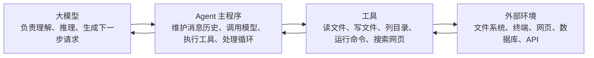
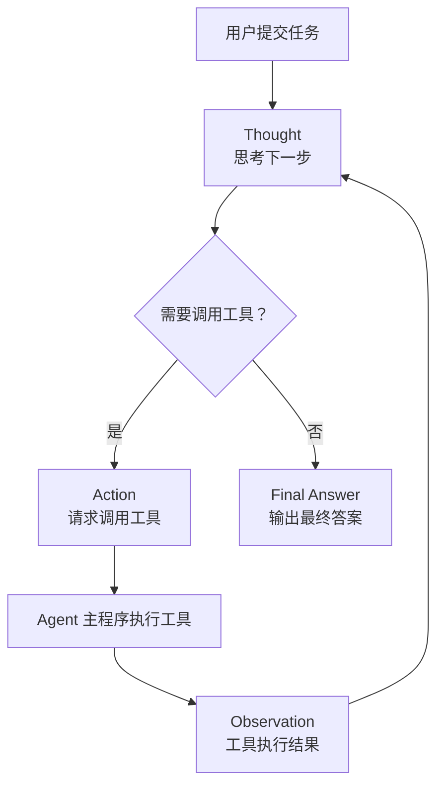
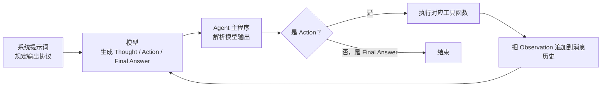
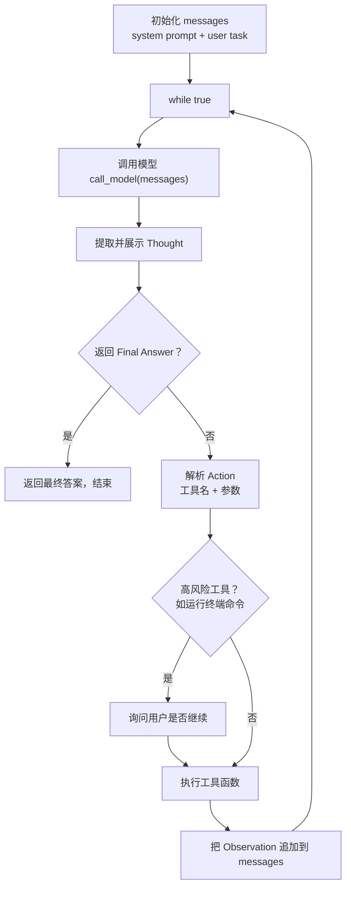
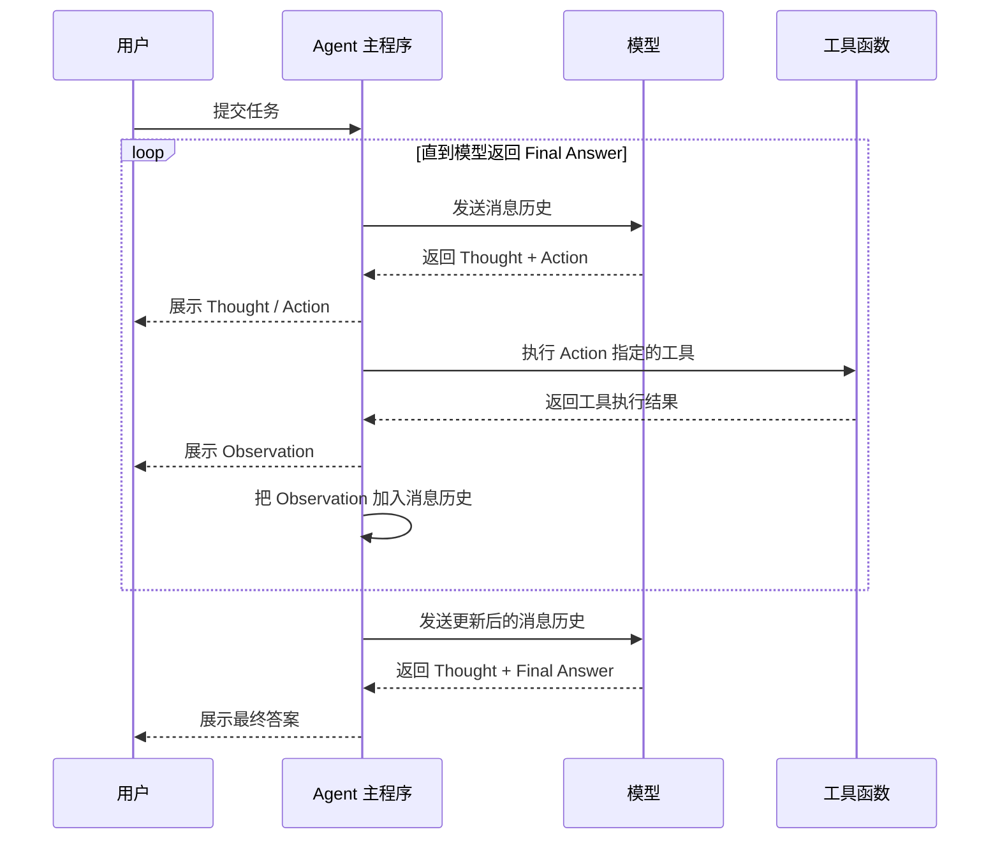
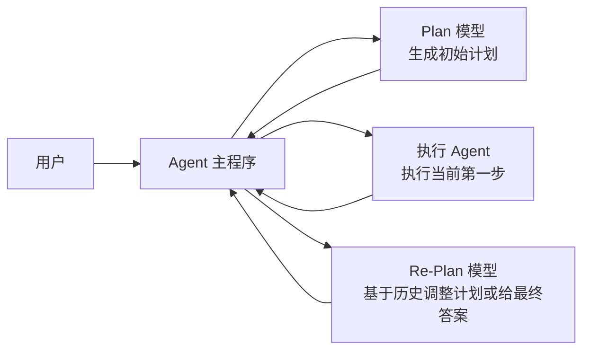
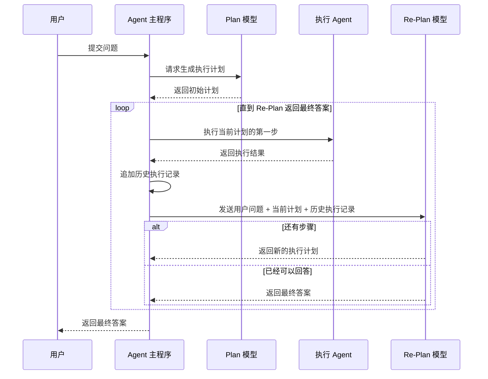
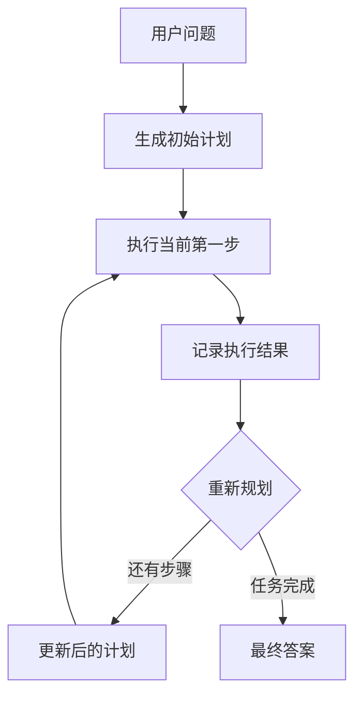

# Agent 的概念、原理与构建模式：从零打造一个简化版的 Claude Code

日期：2026-05-09

来源视频：
[Agent 的概念、原理与构建模式：从零打造一个简化版的 Claude Code](https://www.youtube.com/watch?v=GE0pFiFJTKo)

频道：马克的技术工作坊

发布时间：2025-07-22

时长：28:07

本地素材：

- 视频：`local-media/youtube/2025-07-22-mark-agent-claude-code/Agent 的概念、原理与构建模式 —— 从零打造一个简化版的 Claude Code [GE0pFiFJTKo].mp4`
- QuickTime 兼容视频：`local-media/youtube/2025-07-22-mark-agent-claude-code/Agent 的概念、原理与构建模式 —— 从零打造一个简化版的 Claude Code [GE0pFiFJTKo].quicktime.mp4`
- 字幕：`local-media/youtube/2025-07-22-mark-agent-claude-code/Agent 的概念、原理与构建模式 —— 从零打造一个简化版的 Claude Code [GE0pFiFJTKo].zh-Hans.srt`
- 元数据：`local-media/youtube/2025-07-22-mark-agent-claude-code/Agent 的概念、原理与构建模式 —— 从零打造一个简化版的 Claude Code [GE0pFiFJTKo].info.json`
- 关键画面抽帧：`local-media/youtube/2025-07-22-mark-agent-claude-code/frames/`
- 评论原始数据：`local-media/youtube/2025-07-22-mark-agent-claude-code/comments.json`
- 评论摘要素材：`local-media/youtube/2025-07-22-mark-agent-claude-code/comments-digest.md`

说明：`local-media/` 是本地沉淀目录，已加入 `.gitignore`，避免把 229MB 的视频文件提交进仓库。

## 配套资源 / 代码地址

- 视频：[YouTube 原视频](https://www.youtube.com/watch?v=GE0pFiFJTKo)
- 代码仓库：[MarkTechStation/VideoCode](https://github.com/MarkTechStation/VideoCode)
- LangGraph Plan-and-Execute 教程：[Plan-and-Execute](https://langchain-ai.github.io/langgraph/tutorials/plan-and-execute/plan-and-execute/)
- 来源说明：代码仓库和 LangGraph 教程链接来自作者置顶评论；YouTube 简介/元数据本身没有给出代码 URL。

## 评论区补充

本次抓取评论 142 条，包含作者置顶评论、作者回复和普通评论。评论区对理解视频有三点补充价值：

1. 作者置顶评论补齐了视频简介缺失的代码地址：示例代码在 `MarkTechStation/VideoCode` 仓库里，Plan-and-Execute 的参考实现指向 LangGraph 官方教程。
2. 作者在回复里补充：视频演示是串行执行，但 ReAct 和 Plan-and-Execute 的核心逻辑并不天然排斥并发。如果计划拆出的子任务互不依赖，Plan-and-Execute 可以并发交给多个子 Agent；ReAct 也可以并行发起多个工具调用，只是原始论文和常见示例多按串行写。
3. 作者解释了 Re-Plan 的关键点：重规划不是机械地“缩短计划”，而是基于当前执行结果动态调整剩余计划。它可能删掉已完成步骤，也可能补上漏掉的信息，直到可以直接给出最终答案。

还有几类学习反馈值得记住：

- 有评论把核心概念压缩成“Agent = 大模型 + 工具 + 控制逻辑”，这比很多花哨定义更接近工程本质。
- 有人指出直接运行 GitHub 代码时，Windows 环境或替换模型可能还需要额外调整。也就是说，视频适合理解原理，复现实验时仍要看运行环境、依赖和模型配置。
- 有评论提到“Agent 是大模型的手脚”这个比喻容易误导：更准确地说，是 Agent 主程序调用模型和工具，不是模型自己伸手调用外部世界。
- 评论里也有广告和无关内容，已忽略，不纳入学习笔记。

## 一句话结论

Agent 不是一个神秘东西。它的核心就是：**大模型负责判断和生成下一步请求，Agent 主程序负责维护状态、调用工具、把结果再喂回模型，直到得到最终答案。**

如果把大模型当成“大脑”，工具就是它的“感官和四肢”，Agent 主程序就是把大脑、工具、历史状态串起来的控制循环。

## 视频时间轴

| 时间 | 主题 | 要点 |
|---|---|---|
| 00:00 | 视频内容介绍 | 解释 Agent 是什么，以及 Agent 如何运作。 |
| 00:33 | 什么是 Agent | 大模型本身不能感知或改变外部环境，工具补上这个缺口。 |
| 03:43 | ReAct 模式的运行流程 | Thought、Action、Observation、Final Answer。 |
| 05:27 | ReAct 模式的实现原理 | 核心靠系统提示词约束输出协议，不是模型天生会这样跑。 |
| 10:49 | 动手实现 ReAct Agent | 用 `agent.py`、工具函数、消息循环实现一个简化版 Claude Code。 |
| 18:53 | ReAct 运行时序图 | 用户、Agent 主程序、模型、工具之间如何传递消息。 |
| 20:21 | Plan-and-Execute 模式介绍 | 先规划，再执行，执行过程中动态重规划。 |
| 21:20 | Plan-and-Execute 运行流程 | Plan 模型、Re-Plan 模型、执行 Agent、Agent 主程序协同工作。 |

## 1. 什么是 Agent

普通大模型的能力边界很清楚：它可以生成文本、代码、建议，但它不能直接读取本地文件、写文件、运行命令、浏览网页、调用数据库。

这不是“模型不够聪明”的问题，而是**模型没有外部环境的输入输出通道**。比如让模型写一个贪吃蛇游戏，它能给出代码，但不能自己把代码落到 `index.html`、`style.css`、`script.js`。如果你本地已经有一份代码，模型也不知道，除非你把代码复制给它。

Agent 解决的是这个实际问题：



所以，一个实用定义是：

> Agent = 大模型 + 工具 + 主程序控制循环 + 状态历史。

这里最容易犯错的是把“大模型”和“Agent”混成一个东西。不是。模型只是 Agent 的一部分。真正执行工具、保存状态、处理权限和失败重试的是 Agent 主程序。

## 2. ReAct 模式

ReAct 是 Reasoning and Acting 的缩写，也就是“思考 + 行动”。视频里把它作为理解 Agent 的第一种核心模式。

ReAct 的关键步骤只有四个：

- `Thought`：模型先说明下一步要做什么。
- `Action`：模型请求调用某个工具，并给出参数。
- `Observation`：工具执行后，把结果返回给模型。
- `Final Answer`：模型认为信息足够时，输出最终答案。

它的流程不是复杂架构，而是一个循环：



这张图的重点是：**Action 不是模型真的执行了工具，而是模型输出了一段“我要调用某工具”的请求。** 真正调用函数的是 Agent 主程序。

## 3. ReAct 为什么能跑起来

视频里讲得最有价值的一点是：ReAct 的魔法主要不在训练阶段，而在**系统提示词和主程序解析逻辑**。

系统提示词会告诉模型：

- 你要解决用户任务。
- 你必须按 `thought`、`action`、`observation`、`final_answer` 这套协议输出。
- 每一步先思考，再选择是否调用工具。
- 工具结果会通过 `observation` 返回给你。
- 当信息足够时，输出 `final_answer`。

视频里展示的系统提示词大致包含五块：

| 部分 | 作用 |
|---|---|
| 职责描述 | 定义模型要按 ReAct 流程解决任务。 |
| 示例 | 用样例教模型如何输出 `thought/action/observation/final_answer`。 |
| 可用工具 | 告诉模型有哪些工具、每个工具的参数是什么。 |
| 注意事项 | 给出约束，比如输出格式、不要乱编工具。 |
| 环境信息 | 当前操作系统、工作目录、文件列表等上下文。 |

系统提示词解决“模型该怎么说”，Agent 主程序解决“模型说了以后怎么做”。

这个拆分很重要：



## 4. 简化版 Claude Code 的实现结构

视频里的示例项目只需要关注两个东西：

- `agent.py`：Agent 主程序。
- `snake/`：要被 Agent 操作的项目目录，开始时是空目录。

运行方式类似：

```bash
uv run agent.py snake
```

这里 `snake` 是传给 `agent.py` 的项目目录，Agent 后续读写文件都会围绕这个目录展开。

示例任务是：

```text
写一个贪吃蛇游戏，使用 html、css 和 js 实现，代码分别放在不同文件中。
```

Agent 运行后会经历多轮：

1. 模型返回 `Thought`，说明要先创建 HTML 文件。
2. 模型返回 `Action`，请求调用 `write_to_file`。
3. Agent 主程序真的执行 `write_to_file`，写入文件。
4. 工具返回 `Observation`，比如“写入成功”。
5. Agent 把 `Observation` 放进消息历史，再次请求模型。
6. 模型继续写 CSS、JS。
7. 必要文件完成后，模型返回 `Final Answer`。

这才是“Claude Code 类工具”的底层节奏：不是一次性让模型吐完所有答案，而是**模型请求一步，程序执行一步，把结果反馈回去，再让模型决定下一步**。

## 5. ReAct Agent 主循环

从工程角度看，真正要抓住的是这个主循环：



这个循环里有几个真正的数据结构：

- `messages`：对话历史和状态载体。没有它，模型不知道前面工具执行了什么。
- `tools`：工具名到函数实现的映射。
- `system prompt template`：运行时填入工具列表、目录、文件列表等信息。
- `action parser`：把模型输出里的工具名和参数解析出来。
- `observation`：工具结果，必须重新加入 `messages`，否则下一轮模型看不到。

如果要自己实现，别一上来搞多 Agent。先把这几个数据结构打牢。

## 6. ReAct 时序图

视频中的 ReAct 时序图可以沉淀成下面这张：



这张图里最核心的角色不是模型，而是 Agent 主程序。它负责所有脏活：维护历史、调用模型、解析输出、执行工具、处理权限。

## 7. Plan-and-Execute 模式

ReAct 是边想边做。Plan-and-Execute 是先规划，再执行，并在执行过程中不断修正计划。

视频里提到，这类模式在 Manus、Claude Code 的 TODO 流程里都能看到影子。LangChain 也提出过 Plan-and-Execute 风格的 Agent。

Plan-and-Execute 的模块更多：



这里有个容易忽略的设计：Plan-and-Execute Agent 内部还可以套一个执行 Agent。这个执行 Agent 可以是 ReAct Agent，也可以是别的实现。Plan-and-Execute 不关心它内部怎么做，只关心它能不能完成指定步骤。

## 8. Plan-and-Execute 的运行流程

视频里的例子是：

```text
今年澳网男子冠军的家乡是哪里？
```

初始计划可能是：

1. 查询当前日期。
2. 根据当前年份查询当年澳网男子冠军。
3. 查询这个冠军的家乡。

执行第一步后，系统拿到了当前日期。然后 Re-Plan 模型会根据历史执行记录更新计划，例如把“查询当前日期”去掉，变成：

1. 查询 2025 年澳网男子冠军名字。
2. 查询这位冠军的家乡。

执行第二步后，再继续重规划。最后当所有步骤都完成时，Re-Plan 模型不再返回新计划，而是返回最终答案。

沉淀成流程图就是：



这套模式的关键不是“先写一个 TODO 列表”这么简单，而是它多了一个**重规划闭环**：



## 9. ReAct 和 Plan-and-Execute 对比

| 维度 | ReAct | Plan-and-Execute |
|---|---|---|
| 核心思路 | 边思考边行动 | 先计划，再执行，再重规划 |
| 状态载体 | 消息历史里的 Observation | 计划 + 历史执行记录 |
| 执行粒度 | 每轮决定一个工具调用 | 每轮执行计划中的一个步骤 |
| 优点 | 简单、直接、适合工具调用闭环 | 对长任务更有结构，便于解释当前进度 |
| 代价 | 长任务容易绕路或遗忘全局目标 | 模块更多，延迟和实现复杂度更高 |
| 适用场景 | 文件读写、代码生成、小步工具调用 | 调研、搜索、多步骤任务、需要可见计划的任务 |

不要把 Plan-and-Execute 理解成“高级，所以一定更好”。如果任务很短，ReAct 就够了。为了显得复杂而套多层 Agent，是典型坏味道。

## 10. 工程上的关键提醒

视频主要讲原理，我这里补几条落地时必须记住的工程约束：

1. **模型不会真正调用工具。** 它只是输出一个调用请求，工具调用发生在 Agent 主程序里。
2. **系统提示词不是安全边界。** 它能约束模型输出格式，但不能替代权限控制、路径限制、人审。
3. **`messages` 是 Agent 的状态。** 工具执行结果不写回历史，下一轮模型就等于失忆。
4. **工具协议要稳定。** 工具名、参数结构、返回格式最好固定，否则解析层会变成一坨补丁。
5. **高风险工具必须人审。** 运行终端命令、写文件、改数据库、发邮件、支付调用，都不能默认放飞。
6. **必须有最大循环次数。** ReAct 很容易在坏提示词或坏工具结果下绕圈。
7. **错误也要作为 Observation 返回。** 工具失败不是直接崩掉，而是让模型看到失败原因，再决定下一步。

## 11. 和学习路线的关系

这个视频适合作为 Agent 学习路线里的“底层原理第一课”。

它讲清了三件事：

- Agent 为什么需要工具。
- ReAct Agent 到底怎么循环。
- Plan-and-Execute 为什么比单纯 ReAct 多一个计划和重规划层。

后续继续学 OpenAI Agents SDK、Anthropic Claude Code、MCP、LangGraph 时，不要被框架名带着跑。先问清楚：

- 谁维护状态？
- 谁调用模型？
- 谁解析工具请求？
- 谁执行工具？
- 工具结果怎么回到模型？
- 哪些动作需要人审？

这些问题答不清，框架换十个也只是换皮。

## 参考资料

- 视频：[Agent 的概念、原理与构建模式：从零打造一个简化版的 Claude Code](https://www.youtube.com/watch?v=GE0pFiFJTKo)
- ReAct 论文：[ReAct: Synergizing Reasoning and Acting in Language Models](https://arxiv.org/abs/2210.03629)
- LangChain 文章：[Plan-and-Execute Agents](https://www.langchain.com/blog/plan-and-execute-agents)

## 未验证事项

- 本笔记基于下载到本地的字幕、元数据和关键画面抽帧整理，没有复现视频中的 `agent.py` 示例代码。
- 视频里提到的示例仓库没有拉取运行。后续如果要进入实验阶段，应单独在 `wiki/labs/` 下建最小可运行实验，并写清楚验证命令。
