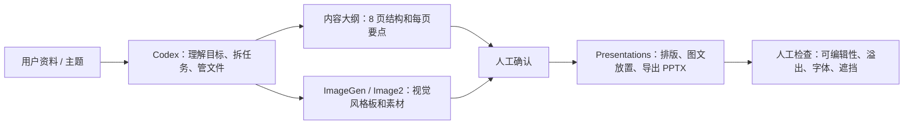
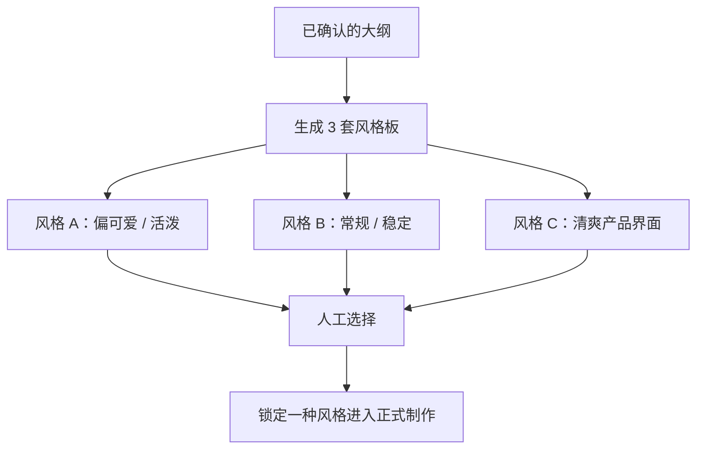
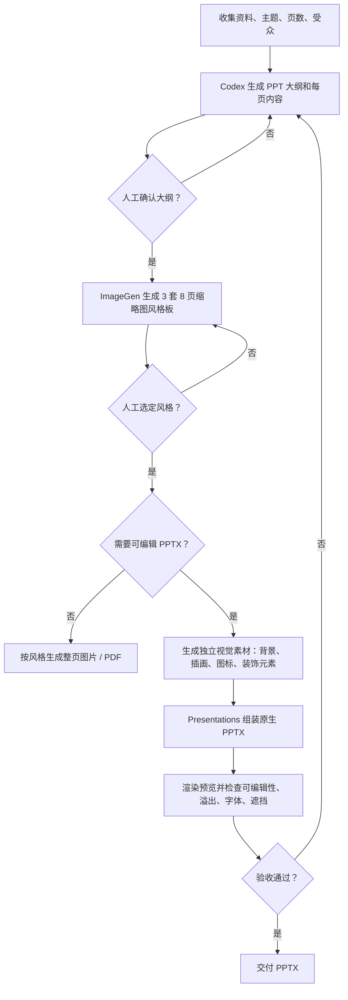

# 用 AI 生成可编辑 PPT：Codex + ImageGen + Presentations 最佳实践拆解

日期：2026-05-23

来源视频：[每天一个AI小技巧：用AI生成可编辑PPT，地表最强方法](https://www.douyin.com/video/7641918938359614726)

频道：欧ge陪你学AI

发布时间：2026-05-20

时长：06:09

本地素材：

- 视频：`local-media/youtube/2026-05-20-ouge-ai-ppt-codex-skills/video-h264-720p.mp4`
- 字幕：`local-media/youtube/2026-05-20-ouge-ai-ppt-codex-skills/video-h264-720p.zh-Hans.srt`
- 字幕说明：抖音页面未提供可直接下载的标准字幕；本字幕由本地 `whisper.cpp` ASR 生成，未逐句人工校对。ASR 中的明显错词已按上下文修正理解，例如 `PBT` -> `PPT`、`Mage Generation` -> `Image Generation`、`Skule` -> `skill`。
- 元数据：`local-media/youtube/2026-05-20-ouge-ai-ppt-codex-skills/douyin-7641918938359614726.info.json`
- 关键画面抽帧：`local-media/youtube/2026-05-20-ouge-ai-ppt-codex-skills/frames/`
- 资产清单：`local-media/youtube/2026-05-20-ouge-ai-ppt-codex-skills/asset-manifest.md`

说明：`local-media/` 是本地沉淀目录，不应提交进 Git。

## 配套资源 / 代码地址

- 视频：https://www.douyin.com/video/7641918938359614726
- 代码仓库：视频简介、元数据和画面中未发现具体代码仓库地址。
- 其他资料：未发现。

## 评论区补充

未抓取评论。抖音页面可见评论入口，但当前沉淀只基于视频正文、页面元数据和关键画面。

## Fieldbook 归档判断

- 内容类型：案例拆解 / 工具观察
- 当前归档：`wiki/notes/openai/`
- 是否值得升级为 lab：是，但不要扩大成“万能 PPT Agent”。
- 判断理由：视频给出了一个真实可复现的工作流假设：Codex 负责编排，ImageGen/Image2 负责视觉资产，Presentations 负责原生 PPTX 排版与导出。真正值得验证的是“可编辑 PPTX”能否稳定成立，而不是一次 demo 是否好看。
- 后续应进入：`wiki/labs/`，做一个 8 页中文 PPTX 最小实验，验证文本可编辑性、元素可拖动性、中文换行、字体替换和渲染预览。

## 一句话结论

视频的核心 SOP 是：不要让图像模型直接生成整套死图 PPT，而是让 Codex 先做内容和任务编排，用 ImageGen/Image2 先选视觉方向、再生产视觉素材，最后交给 Presentations 生成可编辑 PPTX。这个方向对，但视频里“文字也按 PNG 生成”的提示词有硬伤：那会让文字失去原生可编辑性，只能算“可移动图片元素”，不是高质量可编辑 PPT。

## 视频时间轴

| 时间 | 主题 | 要点 |
|---|---|---|
| 00:00-01:36 | 三件套角色分工 | Codex 做导演/项目经理，ImageGen/Image2 做视觉素材，Presentations 做 PPT 叙事、排版、渲染和导出。 |
| 01:39-02:34 | 先做内容大纲 | 让 Codex 先生成 8 页左右的 PPT 大纲和每页内容，预览后等待人工确认，不直接一条龙生成成品。 |
| 02:34-03:58 | 生成视觉风格候选 | 调用 Image Generation skill，一次生成三套视觉风格，每套用一张图压缩展示 8 页缩略图。 |
| 03:58-04:35 | 选择交付路径 | 如果不需要编辑，直接生成 8 张图片或 PDF；如果要真正可编辑，进入 Presentations 路线。 |
| 04:39-05:23 | 生产素材并组装 PPTX | 按选定风格生成页面需要的视觉元素，再用 Presentations 排版、排布并导出 PPTX。 |
| 05:29-06:05 | 检查结果 | 视频称 10 分钟后生成完整 8 页 PPTX，页面元素可以编辑。 |

## 1. 角色分工

视频把 PPT 生成拆成三个明确的数据对象，而不是一句话硬怼到底：

- 内容计划：每页讲什么，信息顺序是什么，哪里需要图表或视觉表达。
- 风格板：多套视觉方向的低成本预览，不急着生成所有页面。
- 视觉素材包：背景、插画、图标、PNG 元素等。
- PPTX 交付物：由 Presentations 负责页面结构、文字、图表、布局、渲染和导出。



这个拆法有现实价值。PPT 不是单一图片生成任务，它同时包含叙事结构、视觉风格、版式排版和文件格式。把这些混成一个 prompt，失败时连问题在哪里都不知道。

## 2. 视频里的 SOP 流程

### SOP-0：准备输入

输入至少要有三类：

- 主题或资料：视频示例是“介绍 Codex 做 PPT 的这一套系统”。
- 页数目标：视频示例是 8 页左右。
- 交付目标：是否需要 `.pptx` 可编辑，而不是只要图片或 PDF。

### SOP-1：让 Codex 先做大纲，不直接生成 PPT

视频中的关键提示词意思是：

```text
请按照这个内容做一个 8 页左右的 PPT。
你可以先生成每一页的大纲和内容，然后给我预览。
预览完成之后，等我提示下一步，你再进行下一步执行。
```

这一步的好处不是“更高级”，而是减少返工。直接生成完整 PPT，得到的效果不一定是想要的；先确认大纲，可以在人类还能低成本干预时修正方向。

### SOP-2：人工审阅大纲，改到满意再继续

视频明确说：如果大纲或内容有问题，就让 Codex 修改；满意后再进入视觉阶段。

这里的验收点：

- 每页标题是否正确。
- 信息顺序是否自然。
- 有没有重复页面。
- 有没有空泛口号。
- 结尾页是否有明确总结。

### SOP-3：用 Image Generation 生成三套风格板

视频中的关键提示词意思是：

```text
现在可以调用 image generation 这个 skill，
去生产实际图片的视觉效果。
请给我三套视觉风格。
每一张图片浓缩这 8 页 PPT，
每张图片代表一套完整视觉方向，
方便我先选择风格。
```

这个步骤是视频里比较有价值的地方。不是一页一页生成图，也不是直接做完整 PPT，而是先生成“8 页缩略图风格板”。原因很简单：风格选错了，后面全部都是废活。



视频最终选择的是第三种“简单、干净、清爽”的风格。

### SOP-4：根据交付要求分流

视频给出两条路径：

| 路径 | 做法 | 适合场景 | 问题 |
|---|---|---|---|
| 快速图片/PDF 路线 | 让 Image2 按选定风格生成 8 张完整页面图片，最多转 PDF | 只展示、不改字、不迭代 | 不是可编辑 PPT，后期维护很差 |
| 可编辑 PPTX 路线 | 生成视觉素材，再由 Presentations 排版并导出 PPTX | 需要交付、复用、修改、审阅 | 更慢，视频示例跑了约 10 分钟 |

视频真正推荐的是第二条。

### SOP-5：生成素材并调用 Presentations 做 PPTX

视频中的关键提示词意思是：

```text
请按第三种风格生成 PPT。
我需要你把里面的每一个视觉元素、图片、文字，
都按照 PNG 的格式去生成。
然后调用 Presentation 插件，
去制作成一个真正的 PPTX 文档，可供我编辑。
```

注意：这是视频原提示词，不等于工程上最好的提示词。它把“文字也按 PNG 生成”放进了素材生成环节，这会带来明显风险：文字可能变成图片，不能作为 PPT 原生文本编辑。

更好的工程化版本应该是：

```text
请按第三种风格生成 PPTX。
视觉素材、插画、图标、背景元素可以生成为独立 PNG。
标题、正文、页脚、图表标签必须使用 PPT 原生文本对象，
不要把正文文字烘焙进整页图片。
最后调用 Presentations 生成可编辑 PPTX，并渲染预览检查溢出、遮挡和字体替换。
```

这不是挑刺，是边界问题。可编辑 PPT 的核心数据结构应该是“原生文本 + 原生形状/图表 + 可替换图片资产”，不是一堆带字的 PNG。

### SOP-6：结果检查

视频最后展示了完整 8 页 PPTX，并强调每个元素可以编辑。对真正交付来说，还要补上这些检查：

- `.pptx` 能否在 PowerPoint 或 Keynote 打开。
- 标题、正文是否真的是原生文本框。
- 图片、图标、背景是否能单独替换。
- 中文是否有溢出、截断、字体替换。
- 图表是否可编辑，而不是截图。
- 每页是否和风格板一致，没有中途风格漂移。

## 3. 可复用 SOP



## 工程提醒

1. 不要把“整页图片”伪装成 PPT。那只是把后期维护成本推给用户。
2. 风格板是低成本决策点，应在生成所有素材之前做。
3. 内容大纲必须先确认。否则视觉做得越漂亮，返工越痛。
4. 如果要可编辑，文字必须保留为 PPT 原生文本对象。
5. ImageGen 更适合生成视觉资产，不适合承担精确文字排版。
6. Presentations 的价值是 PPTX 结构化生成、排版、渲染和导出，不只是把图片塞进幻灯片。
7. 生成过程可能慢，视频示例正式生成阶段约 10 分钟；不要把它包装成秒出稳定交付。

## 工程判断

【核心判断】

✅ 值得做：这个 SOP 把 PPT 生成拆成“内容确认 -> 风格确认 -> 素材生成 -> PPTX 组装 -> 人工验收”，是实际交付需要的流程。

【关键洞察】

- 数据结构：真正的产物不是图片，而是 `.pptx` 里的文本框、形状、图表、图片素材和版式关系。
- 复杂度：先用 3 张风格板选方向，可以避免一页一页生成后整体推翻。
- 风险点：视频原提示词要求文字也按 PNG 生成，这会破坏“文本可编辑”的核心目标。

【Linus 式方案】

1. 第一步永远是确定 PPT 的数据结构：大纲、页面、文本、视觉素材、PPTX 对象。
2. 消除特殊情况：不要同时走“整页图片”和“可编辑 PPTX”两套混乱路径，先按交付目标分流。
3. 用最笨但清晰的方式实现：先大纲，后风格板，再素材，最后 PPTX。
4. 确保零破坏性：文本保持原生可编辑，图片只是资产，不要烧死整页。

## 后续研究问题

- Presentations / Slides 生成的 PPTX，哪些元素是真正原生对象，哪些只是图片？
- 中文字体、换行和溢出是否能自动检测？
- ImageGen 生成素材时，如何稳定保持同一视觉风格？
- 能否把“风格板 -> 设计 token -> PPTX 版式模板”沉淀成可复用 skill？
- 多次重复生成时，结构是否稳定，还是每次都漂移？

## 实验验证建议

- 要验证什么：Codex + ImageGen + Presentations 能否稳定生成一份可编辑、可审查、可迭代的中文 PPTX。
- 最小实验形式：8 页“AI Agent Fieldbook 路线图”PPT，输入只有 Markdown 大纲、品牌色说明和少量图片资产。
- 验收标准：`.pptx` 可打开；标题和正文可编辑；至少 80% 页面无明显溢出/遮挡；图片资产可单独替换；同一输入重复生成结构不大幅漂移。
- 是否现在就做：否。本次任务是视频 SOP 拆解；实验应单独进入 `wiki/labs/`。

## 参考资料

- 视频：[每天一个AI小技巧：用AI生成可编辑PPT，地表最强方法](https://www.douyin.com/video/7641918938359614726)
- 本地资产：`local-media/youtube/2026-05-20-ouge-ai-ppt-codex-skills/`
- 相关调研：[AI 做 PPT：Codex app + ImageGen + Slides/Presentations 抖音调研报告](../../research/use-cases/2026-05-20-ai-ppt-codex-imagegen-slides-douyin-research.md)

## 未验证事项

- 本笔记基于抖音页面元数据、本地 ASR 字幕和关键画面整理；ASR 未逐句人工校对。
- 未拿到视频作者实际生成的 `.pptx` 文件，因此“每个元素可编辑”是视频展示/作者说法，未本地复验。
- 未运行 Codex + ImageGen + Presentations 的完整实验。
- 未抓取评论区补充信息。
