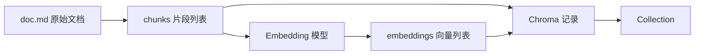
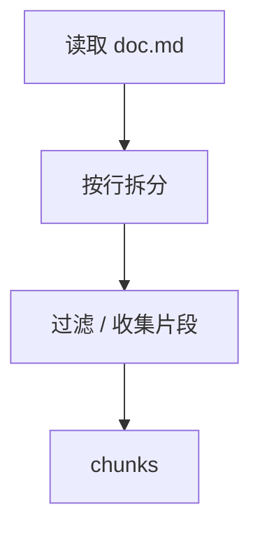
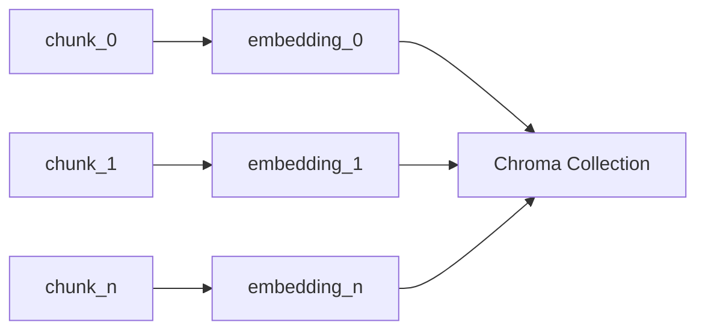
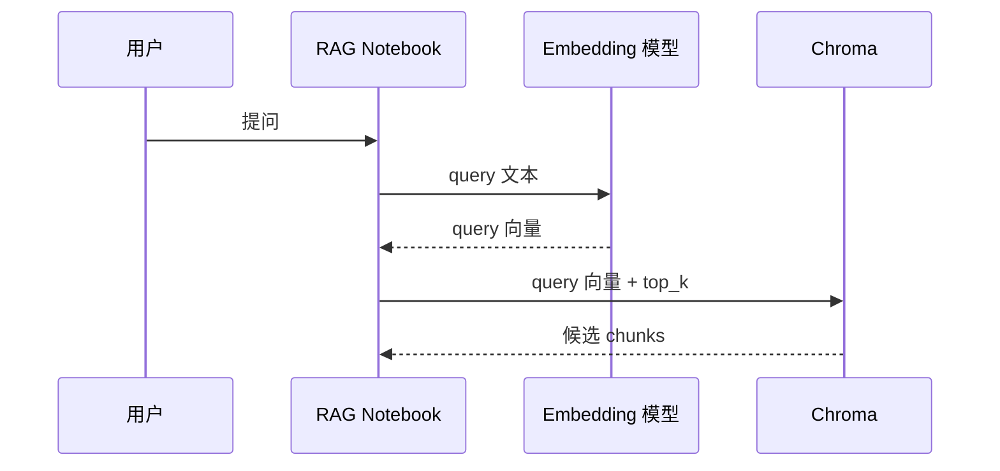
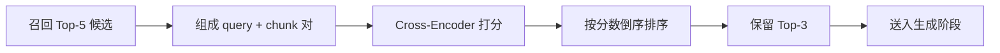
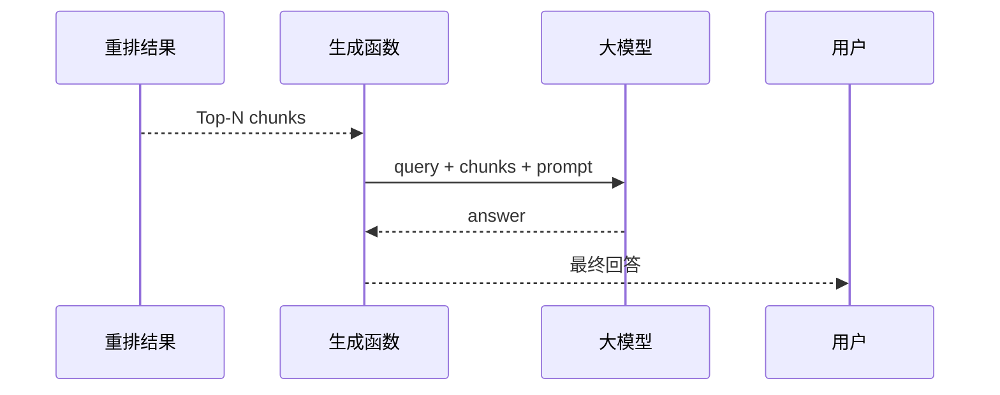

# 使用Python构建RAG系统 —— 用代码还原 RAG系统的每个细节

日期：2026-05-11

来源视频：[使用Python构建RAG系统 —— 用代码还原 RAG系统的每个细节](https://www.youtube.com/watch?v=D8mqIMeZ4fQ)

频道：马克的技术工作坊

发布时间：2025-07-06

时长：17:31

本地素材：

- 视频：`local-media/youtube/2025-07-06-mark-python-rag-system/使用Python构建RAG系统 —— 用代码还原 RAG系统的每个细节 [D8mqIMeZ4fQ].quicktime.mp4`
- 字幕：`local-media/youtube/2025-07-06-mark-python-rag-system/使用Python构建RAG系统 —— 用代码还原 RAG系统的每个细节 [D8mqIMeZ4fQ].quicktime.zh-Hans.srt`
- 字幕说明：字幕来源为 YouTube 字幕或自动字幕，不是本地 ASR；本笔记未逐句人工校对字幕。
- 元数据：`local-media/youtube/2025-07-06-mark-python-rag-system/使用Python构建RAG系统 —— 用代码还原 RAG系统的每个细节 [D8mqIMeZ4fQ].quicktime.info.json`
- 缩略图：`local-media/youtube/2025-07-06-mark-python-rag-system/使用Python构建RAG系统 —— 用代码还原 RAG系统的每个细节 [D8mqIMeZ4fQ].quicktime.webp`
- 关键画面抽帧：`local-media/youtube/2025-07-06-mark-python-rag-system/frames/`
- 关键画面总览：`local-media/youtube/2025-07-06-mark-python-rag-system/frames/contact-keyframes.jpg`
- 评论原始数据：`local-media/youtube/2025-07-06-mark-python-rag-system/comments.json`
- 评论摘要素材：`local-media/youtube/2025-07-06-mark-python-rag-system/comments-digest.md`

说明：`local-media/` 是本地沉淀目录，不应提交进 Git。

## 配套资源 / 代码地址

- 视频：<https://www.youtube.com/watch?v=D8mqIMeZ4fQ>
- 代码仓库：<https://github.com/MarkTechStation/VideoCode/tree/main/使用Python构建RAG系统/rag>
- 作者在评论区补充的 n8n RAG 参考：<https://blog.n8n.io/rag-chatbot/>
- 相关本地笔记：[RAG 工作机制详解——一个高质量知识库背后的技术全流程](RAG%20工作机制详解——一个高质量知识库背后的技术全流程.md)

## 评论区补充

- 已抓取 49 条评论，置顶评论就是本视频的代码地址。
- 作者在评论里补充：RAG 偏向从外部知识库取信息来提升回答的依据，MCP 偏向让模型和外部环境互动；二者不冲突，可以把 RAG 包成 MCP 工具给 Agent 调用。
- 有评论追问 n8n 是否能直接接入 RAG。作者回复说 n8n 可以直接接入 RAG，并给出 n8n 官方博客链接；这属于工具实践方向，不是本视频代码主线。
- 高赞评论里多次提到“这是基础架构”。这个判断是对的：视频适合入门理解 RAG 流水线，不适合直接当生产知识库方案。
- 有评论指出切片粒度会影响效果：片段太大浪费上下文，片段太小会损伤语义完整性。这个问题比换框架更关键。
- 有评论问 SentenceTransformer 遇到超长片段是否会截断。这个提醒很重要：如果分片策略不受控，模型最大序列长度会变成隐性 bug。
- 有用户反馈按视频步骤复现时，召回结果没有命中完整答案，导致最终回答缺失。这说明 demo 的可运行不等于检索质量稳定，必须做评估。

## Fieldbook 归档判断

- 内容类型：实验验证
- 当前归档：`wiki/notes/`
- 是否值得升级为 lab：是，但本次不直接升级。
- 判断理由：视频给出了可运行的最小 RAG 链路，适合拆成一个小实验验证“召回 Top-K + Cross-Encoder 重排”是否稳定提升答案片段排名。现在用户要求是沉淀学习笔记，不是复现代码；没有必要顺手把实验、依赖安装和 API Key 配置全做了。
- 后续应进入：优先补到 `wiki/labs/openai/03-tools-and-rag/` 的对照实验；如果要保留 Gemini 版本，再单独建一个最小 RAG lab。

## 一句话结论

这期视频的价值不是“教你装几个库”，而是把 RAG 拆成五个清楚的函数边界：文档先切成 chunk，再把 chunk 变成 embedding 存进向量库；用户提问时先召回候选片段，再用 Cross-Encoder 重排，最后只把少量高相关片段交给大模型生成答案。

## 视频时间轴

| 时间 | 主题 | 要点 |
|---|---|---|
| 00:00 | RAG 原理回顾 | RAG 分成提问前的数据准备和提问后的回答链路。 |
| 01:37 | 代码地址与工具准备 | 代码在 GitHub；视频使用 uv 和 Jupyter Notebook。 |
| 02:25 | 项目环境搭建 | 初始化项目，安装 `sentence_transformers`、`chromadb`、`google-genai`、`python-dotenv`。 |
| 05:27 | 开始写代码 | 依次实现分片、向量化、写入向量库、召回、重排、生成。 |
| 08:30 | Embedding | 用 SentenceTransformer 把文本片段转成 768 维向量。 |
| 10:15 | Chroma 索引 | 用 Chroma Collection 保存片段文本、向量和 ID。 |
| 12:00 | 召回 | 把用户问题转向量，查询 Top-K 相似片段。 |
| 13:30 | 重排 | 用 Cross-Encoder 对召回结果重新打分，改善排序。 |
| 15:30 | 生成 | 把用户问题和重排后的片段拼成 prompt，调用 Gemini 生成答案。 |

## 1. 这套 demo 的核心数据结构

RAG 代码不要先看库名，先看数据结构。视频里的核心数据只有四类：

| 数据 | 代码里的形态 | 作用 |
|---|---|---|
| 原始文档 | `doc.md` | 知识来源，视频用一篇虚构故事做测试材料。 |
| 片段列表 | `chunks: List[str]` | 被检索和送入模型的最小文本单位。 |
| 向量列表 | `embeddings: List[List[float]]` | 每个片段的语义索引。 |
| 向量库记录 | `ids + chunks + embeddings` | Chroma Collection 里的可查询数据。 |

这比直接把文档塞给模型强，因为它把存储、检索和生成拆开了。



但这个数据结构也很薄。它只有 `id`、文本和向量，没有来源文件、章节、页码、权限、更新时间、chunk 策略、引用信息。做教学可以，做企业知识库就不够。

## 2. 环境搭建：工具只是入口，不是架构

视频使用的工具链：

| 工具 / 依赖 | 视频中的用途 |
|---|---|
| `uv` | 初始化 Python 项目、安装依赖、启动 Jupyter。 |
| Jupyter Notebook | 逐段运行代码，适合观察每一步输出。 |
| `sentence_transformers` | 加载 Embedding 模型和 Cross-Encoder 模型。 |
| `chromadb` | 保存和查询向量。 |
| `google-genai` | 在生成阶段调用 Gemini。 |
| `python-dotenv` | 从 `.env` 加载 `GEMINI_API_KEY`。 |

这里有个实际提醒：notebook 适合学习，不适合直接当服务。Notebook 的好处是每一步都能看到中间结果；坏处是状态容易散在多个 cell 里，执行顺序错了就出现幽灵状态。要进生产，必须把这些 cell 拆成明确的模块和可重复执行的命令。

## 3. 分片：视频用最简单方案，问题也在这里

视频里的 `split_into_chunks(doc_file)` 做法很直接：读取 `doc.md`，按行切成片段，最后得到 10 个 chunk。



这个方案好在清楚，坏在粗糙。按行切分只适合结构非常规整的测试文本。真实文档里，一行可能太长，也可能只是一个标题；一段可能超过模型最大长度，也可能必须和上下段一起看才完整。

更好的分片策略至少要考虑：

- chunk 最大 token 数，而不是只看字符或行数。
- 是否需要 overlap，避免答案跨片段断裂。
- 标题、章节、页码是否要拼进 chunk。
- 表格、代码块、列表是否需要保留结构。
- 后续答案是否要带引用来源。

评论区提醒“切片大小影响 RAG 效果”，这不是吹毛求疵。RAG 最常见的坏味道就是上层代码写得热闹，底层 chunk 乱切，最后召回全靠运气。

## 4. 索引：Embedding 不是答案，只是检索索引

视频先用 `SentenceTransformer` 加载 Embedding 模型，再写 `embed_chunk(chunk)`，把每个文本片段转成向量。示例输出显示向量维度是 768。

接着循环处理所有 chunk，得到：

```text
chunks      -> 10 个文本片段
embeddings  -> 10 个向量
```

这一步的关键是数据一一对应。第 0 个 chunk 必须对应第 0 个 embedding；一旦错位，向量库能正常返回结果，但返回的是错答案。这种 bug 表面很安静，实际上很烂。



视频用 Chroma 的 `EphemeralClient` 创建内存数据库。这个选择适合 demo：脚本结束数据就清掉，不污染环境。如果要保存到磁盘，视频提到可以换成 `PersistentClient`。

生产系统不能只关心“存进去了没有”。至少还要关心：

- ID 是否稳定，重复写入会不会覆盖或膨胀。
- 文档更新后旧 chunk 如何删除。
- embedding 模型换版本后是否要重建索引。
- 元数据和权限过滤是否和向量检索一起生效。
- Chroma 输出的错误或警告是否真的无害。

视频里出现 Chroma 相关错误信息，作者说不影响当前执行。学习时可以先继续，生产里不能这么处理。错误如果能忽略，就应该被明确降级和记录；如果不能解释，就不该装作没发生。

## 5. 召回：先扩大候选，不要一上来追求精确

召回函数 `retrieve(query, top_k)` 做三件事：

1. 把用户问题转成 query embedding。
2. 用 query embedding 查询 Chroma。
3. 返回最相近的 Top-K chunk。



视频测试问题是“哆啦A梦使用的三个秘密道具分别是什么”。召回 Top-5 后，答案片段被召回了，但没有排在第一。

这正好说明向量召回的边界：它适合从大量片段里粗筛候选，不适合保证最相关片段永远排第一。硬把召回当最终排序，就是数据结构和模型能力都没看清。

## 6. 重排：把昂贵的精排放在小集合上

视频下一步用 Cross-Encoder 实现 `rerank(query, retrieved_chunks, top_k)`：

1. 把每个候选片段和 query 组成一对。
2. 让 Cross-Encoder 给每一对打相关性分数。
3. 按分数倒序排列。
4. 取前 `top_k` 个片段。



这个设计有好品味：召回负责便宜、快速地把范围缩小；重排负责在小集合里做更精确判断。特殊情况没有靠一堆 if 修补，而是用两阶段检索把问题拆对了。

但也别神化重排。Cross-Encoder 更慢，通常不能拿来扫全库。它的正确位置是在召回之后、生成之前。

## 7. 生成：模型只看少量证据

生成阶段 `generate(query, chunks)` 的输入是：

- 用户问题。
- 重排后的少量相关片段。
- 拼出来的 prompt。

视频使用 `python-dotenv` 读取 `.env` 中的 `GEMINI_API_KEY`，再用 `google-genai` 调用 Gemini 2.5 Flash 生成答案。



这里要划清边界：视频证明的是“RAG 流程能跑通”，不是证明“回答必然正确”。最终答案是否可靠，取决于前面的检索是否命中、片段是否完整、prompt 是否约束模型只基于资料回答，以及有没有评估集。

## 8. 从 demo 到可用系统，还缺什么

这个视频适合做最小实现，但离可用知识库还差几个硬东西：

| 缺口 | 为什么重要 |
|---|---|
| 稳定分片策略 | 片段质量直接决定召回质量。 |
| 元数据 | 没有来源、页码、章节，就很难解释答案从哪里来。 |
| 权限过滤 | 用户无权看的内容不能被召回。 |
| 评估集 | 没有问题集和期望答案，就只能凭感觉调参。 |
| 错误处理 | Chroma、模型下载、API 调用失败都要有明确路径。 |
| 版本固定 | Embedding 模型、reranker、向量库版本变化会影响结果。 |
| 引用输出 | 企业问答通常需要给出证据来源，不只是自然语言答案。 |

RAG 的第一性问题不是“用哪个框架”，而是这些数据怎么流动、谁拥有、谁更新、失败时系统如何表现。框架可以换，数据结构错了就全错。

## 工程提醒

1. `.env` 只能留在本地，`GEMINI_API_KEY` 不能提交进仓库。
2. 教程里“错误不影响执行”的说法只适合短 demo；正式代码要解释错误来源，至少记录版本、调用参数和降级行为。
3. 不要把 `EphemeralClient` 误当成持久知识库。它的价值是干净、短生命周期。
4. chunk ID 不要随手用 `0..n`，文档更新后会很难做增量维护；至少要和文档 ID、chunk 序号或内容 hash 绑定。
5. 召回 Top-K 和重排 Top-N 是需要评估的参数，不是视频里写多少就照抄多少。
6. 如果把 RAG 接进 Agent 工具，所有高风险动作仍然要有人审：执行 shell、写文件、改数据库、发邮件、支付、部署、账号操作，都不能因为“检索到了文档”就自动放行。

## 工程判断

- 适合什么场景：RAG 入门、教学 demo、理解分片到生成的完整链路、给已有 RAG 概念笔记补一层代码直觉。
- 不适合什么场景：直接做企业知识库、权限敏感问答、需要引用溯源的客服系统、需要稳定评估的生产 Agent。
- 风险和边界：视频选择了最简单的数据结构，故意牺牲了很多工程细节。这个取舍没问题，因为它是在讲原理；问题是学习者容易把 notebook demo 当成架构模板。

## 后续研究问题

- 不同 chunk 策略对召回率和最终答案质量的影响有多大？
- 对中文文档，应该优先比较哪些 embedding 模型和 reranker？
- Chroma 的 `EphemeralClient`、`PersistentClient` 和生产部署模式分别适合什么边界？
- RAG 结果如何返回引用来源，才能让用户检查证据？
- RAG 如何作为 MCP Tool 暴露给 Agent，并保留权限、人审和可追踪日志？
- n8n 这类工作流工具直接接 RAG 的优势和代价是什么？

## 实验验证建议

- 要验证什么：在同一份 `doc.md` 上，单纯向量召回和“召回 + Cross-Encoder 重排”对答案片段排名的影响。
- 最小实验形式：准备 5-10 个问题，每个问题标注应该命中的 chunk；记录 retrieve Top-K、rerank Top-N、最终 prompt 和模型答案。
- 是否现在就做：否。本次任务是视频沉淀，没有执行 notebook、下载模型或配置 Gemini API Key。
- 可放置位置：优先扩展 `wiki/labs/openai/03-tools-and-rag/`，把生成模型换成当前主线 OpenAI 技术栈；如果要严格复现视频，再建 Gemini 版本对照。

## 参考资料

- 视频：<https://www.youtube.com/watch?v=D8mqIMeZ4fQ>
- 配套代码：<https://github.com/MarkTechStation/VideoCode/tree/main/使用Python构建RAG系统/rag>
- n8n RAG chatbot 参考：<https://blog.n8n.io/rag-chatbot/>
- uv 官方文档：<https://docs.astral.sh/uv/>
- Sentence Transformers 文档：<https://www.sbert.net/>
- Chroma 文档：<https://docs.trychroma.com/>
- Google Gemini API 文档：<https://ai.google.dev/gemini-api/docs>
- 本地概念笔记：[RAG 工作机制详解——一个高质量知识库背后的技术全流程](RAG%20%E5%B7%A5%E4%BD%9C%E6%9C%BA%E5%88%B6%E8%AF%A6%E8%A7%A3%E2%80%94%E2%80%94%E4%B8%80%E4%B8%AA%E9%AB%98%E8%B4%A8%E9%87%8F%E7%9F%A5%E8%AF%86%E5%BA%93%E8%83%8C%E5%90%8E%E7%9A%84%E6%8A%80%E6%9C%AF%E5%85%A8%E6%B5%81%E7%A8%8B.md)

## 未验证事项

- 本笔记基于 YouTube 字幕/自动字幕、元数据、关键画面和评论区整理，未逐句人工校对字幕。
- 没有运行配套 notebook，没有安装视频依赖，也没有下载 Embedding 或 Cross-Encoder 模型。
- 没有配置或调用 Gemini API；视频中关于 Gemini 2.5 Flash 的可用性、价格和调用方式不作为当前事实引用。
- 没有逐行审阅 GitHub 配套代码，只确认了评论区和元数据里出现的代码地址。
- 没有复现 Chroma 报错，也没有判断该报错在当前版本中是否仍然存在。
- 没有验证不同 chunk 策略、Top-K、Top-N 和模型选择对结果质量的影响。
