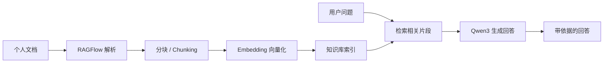
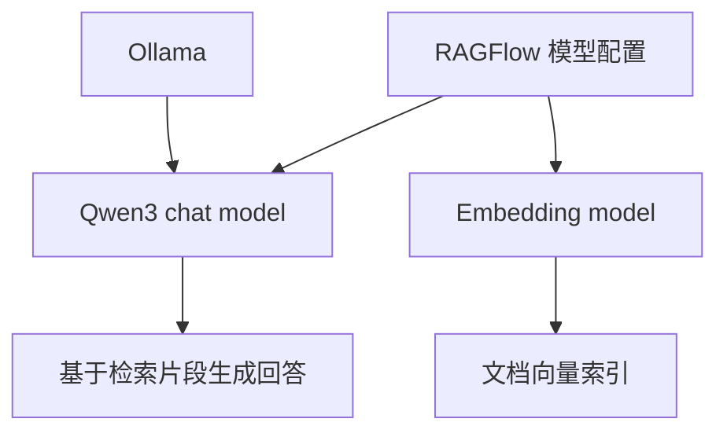
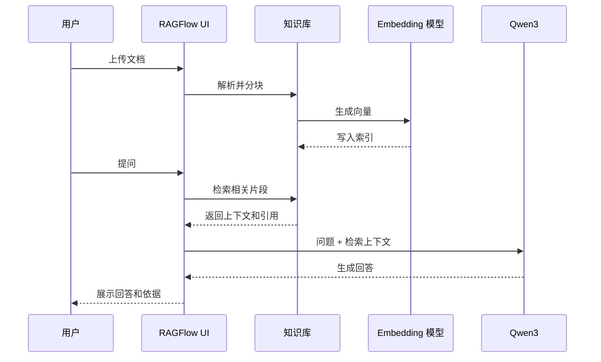

# Qwen3 + RAGFlow 构建个人知识库

日期：2026-05-12

来源视频：[【喂饭教程】25分钟教会你用Qwen3+RAGFlow构建个人知识库，2025最详细，全程干货无废话，草履虫都能学会！大模型|LLM](https://www.youtube.com/watch?v=55C2TqlSt1Y)

频道：AI大模型小冉Agent

发布时间：2025-08-30

时长：24:35

本地素材：

- 视频：`local-media/youtube/2026-05-12-ragflow-55c2tqlst1y/【喂饭教程】25分钟教会你用Qwen3+RAGFlow构建个人知识库，2025最详细，全程干货无废话，草履虫都能学会！大模型｜LLM [55C2TqlSt1Y].quicktime.mp4`
- 音频：`local-media/youtube/2026-05-12-ragflow-55c2tqlst1y/audio-16k.wav`
- 字幕：缺失
- 字幕说明：YouTube 未暴露可用字幕轨道；本次尝试 `whisper.cpp` base-q5_1 与 tiny ASR，均因耗时过长中断，未生成可用 ASR 字幕，也未逐句人工校对。
- 元数据：`local-media/youtube/2026-05-12-ragflow-55c2tqlst1y/【喂饭教程】25分钟教会你用Qwen3+RAGFlow构建个人知识库，2025最详细，全程干货无废话，草履虫都能学会！大模型｜LLM [55C2TqlSt1Y].quicktime.info.json`
- 关键画面抽帧：`local-media/youtube/2026-05-12-ragflow-55c2tqlst1y/frames/`
- 评论原始数据：`local-media/youtube/2026-05-12-ragflow-55c2tqlst1y/comments.json`
- 评论摘要素材：`local-media/youtube/2026-05-12-ragflow-55c2tqlst1y/comments-digest.md`
- 素材清单：`local-media/youtube/2026-05-12-ragflow-55c2tqlst1y/asset-manifest.md`

说明：`local-media/` 是本地沉淀目录，不应提交进 Git。

## 配套资源 / 代码地址

- 视频：https://www.youtube.com/watch?v=55C2TqlSt1Y
- RAGFlow GitHub：https://github.com/infiniflow/ragflow
- RAGFlow v0.25.2 release：https://github.com/infiniflow/ragflow/releases/tag/v0.25.2
- 视频置顶资源链接：https://mp.weixin.qq.com/s/SdVrQUjeD_FtXkLE7VJI2Q
- 代码仓库：视频简介、元数据和评论区未发现本视频专属代码仓库地址。

## 评论区补充

评论区只有 1 条置顶评论，来自上传者，内容是“视频配套资料 + 大模型全套学习包”的微信文章链接。它可能包含课件或资料包，但本次没有打开并核验微信文章内容，所以不能把它当作已经验证的代码来源。

## Fieldbook 归档判断

- 内容类型：工具观察 / 资料消化
- 当前归档：`wiki/notes/`
- 是否值得升级为 lab：暂不升级
- 判断理由：视频是个人知识库搭建演示，核心价值在于把 RAGFlow 的 UI 流程、Qwen3 接入和知识库问答链路串起来。它没有提供可直接复现实验的完整配置文件、评估集、失败样例或企业级验收标准。硬上 lab 只会制造一个“能跑起来”的玩具实验，价值不大。
- 后续应进入：如要研究企业落地，应进入 `wiki/research/use-cases/` 做场景拆解；只有在明确要验证 RAGFlow 的解析质量、召回质量、权限隔离或 API 集成时，才升级到 `wiki/labs/`。

## 一句话结论

这个视频适合当作“个人知识库快速入门路线图”：用 Docker 起 RAGFlow，用 Ollama 或在线 API 接入 Qwen3，再配置单独的 embedding 模型，把文档上传到知识库后做检索问答。但个人演示不能直接推出企业可落地，企业问题不在“能不能问答”，而在数据权限、同步、可追溯、评估、运维和成本控制。

## 视频说法与当前事实校准

| 项目 | 视频中的重点 | 2026-05-12 当前事实 |
|---|---|---|
| RAGFlow 定位 | 用 RAGFlow 搭建个人知识库，解决大模型不知道个人私有资料的问题。 | RAGFlow README 当前称其为融合 RAG 与 Agent 能力的开源 RAG engine/context layer，目标是给 LLM 提供更好的上下文层。 |
| 最新版本 | 视频演示基于 2025 年发布时的界面和流程。 | GitHub 最新 release 为 `v0.25.2`；GitHub API `published_at` 为 `2026-05-09T11:07:44Z`，官方 release notes 写 `Released on May 11, 2026`。 |
| 自托管门槛 | 视频展示本地 Docker 部署，偏个人电脑演示。 | 官方最低要求：CPU 4 cores、RAM 16GB、Disk 50GB、Docker 24、Docker Compose 2.26.1；预构建镜像面向 x86；自 `v0.22.0` 起只发布 slim 镜像。 |
| 关键能力 | 文档上传、分块、知识库问答、引用私有资料回答。 | 当前关键特性包括 DeepDoc 深度文档理解、模板化 chunking、grounded citations、异构数据源、自动化 RAG workflow、可配置 LLM/embedding、多路召回加融合重排、API 集成。 |
| v0.25.2 变化 | 视频没有覆盖。 | v0.25.2 强调 RESTful API 迁移且保持 legacy endpoint 兼容；8 类数据源删除文件同步快照；修复元数据可见性、重复输出、ES metadata filtering 性能问题。 |

参考核验：RAGFlow GitHub README 与 v0.25.2 release 页面。

## 视频时间轴

无字幕和章节元数据，本时间轴依据关键帧抽样整理，精度有限。

| 时间 | 主题 | 要点 |
|---|---|---|
| 00:00-03:30 | 为什么不用网页大模型直接上传文件 | 视频把问题归结为隐私保护和个性化知识库；网页上传附件能问，但不等于可持续管理知识。 |
| 03:30-05:16 | 为什么用 RAG | RAG 用外部知识库检索相关资料，再让模型基于检索结果生成，降低“瞎编”。 |
| 05:16-07:01 | Embedding 的角色 | Qwen3 负责对话生成，但知识库检索还需要 embedding 模型把文本转成向量。 |
| 07:01-10:32 | 本地部署路径 | 下载 Ollama、本地拉取 Qwen3；下载 RAGFlow 源码和 Docker，用 Docker Compose 启动服务。 |
| 10:32-12:17 | RAGFlow 源码与 Docker 启动 | 关键帧显示 GitHub clone、PowerShell 运行 Docker Compose、容器启动。 |
| 12:17-15:48 | 添加 LLM | 在 RAGFlow UI 中添加模型，模型类型为 chat，模型名称示例为 `qwen3:8b`，基础 URL 指向 Ollama 服务，最大 token 示例为 8888。 |
| 15:48-19:18 | 创建知识库并上传文档 | 关键帧显示知识库“公司内部信息管理助手”，上传多个 Markdown 文件，RAGFlow 进行分块。 |
| 19:18-22:49 | 聊天验证 | 上传后进入聊天页面，围绕“员工请假流程”等内部资料提问，验证回答是否来自知识库。 |
| 22:49-24:35 | 是否必须本地部署 | 视频给出简化方案：可以使用在线模型 API 和在线 embedding，但隐私、费用、API 额度和企业安全要单独考虑。 |

## 1. 这个问题的本质

网页大模型上传文件只是一次性上下文，不是知识库。真正的个人知识库至少要有四个东西：

1. 可持续管理的文档集合。
2. 文档解析、分块和索引。
3. 查询时的检索、重排和引用。
4. 一个能基于检索结果回答的 chat model。

视频的好处是把这条链路讲得直：不要把所有东西都塞给大模型。大模型不是数据库，也不是权限系统，更不是文档管理系统。RAGFlow 承担的是“资料进入、变成可检索上下文、把上下文喂给模型”的中间层。

## 2. Qwen3 接入要点

视频中的 Qwen3 接入是典型“本地模型服务 + RAG 平台配置”：

1. 用 Ollama 在本地拉起 Qwen3，例如关键帧中出现 `qwen3:8b`。
2. 在 RAGFlow 的模型配置里新增 LLM，模型类型选择 chat。
3. 模型名称要和本地服务暴露的模型名一致。
4. Base URL 指向 Ollama 服务地址，关键帧里是局域网 IP 加 `11434` 端口。
5. API key 在纯本地 Ollama 场景通常不是重点；在线 API 场景则必须按供应商要求配置。
6. 不能只配 Qwen3。知识库检索还需要 embedding 模型，否则文档无法被稳定转成向量空间里的可召回对象。

这部分最容易犯的错是把 chat model 和 embedding model 混为一谈。Qwen3 负责“说人话”，embedding 模型负责“把文档和问题放到同一个可检索空间”。这两个职责不一样，硬塞成一个概念就是坏设计。

## 3. 个人知识库流程

视频里的个人知识库路径可以压成一条线：

1. 本地部署 RAGFlow。
2. 配置 chat model 和 embedding model。
3. 创建知识库。
4. 上传个人或内部文档。
5. 等待解析、分块和索引。
6. 创建聊天助手或对话。
7. 针对文档内容提问，看回答是否引用了正确资料。

这条线适合个人学习，因为每一步都有可见 UI，失败了也容易肉眼定位：模型没通、文档没解析、知识库没建、聊天没选对知识库。个人演示里最有用的不是“效果很神”，而是把数据流摆出来了。

## 4. 哪些能迁移到企业场景

能迁移的是基础数据流和职责拆分：

- 文档进入知识库前需要解析、清洗、分块。
- chat model 与 embedding model 要分开配置和评估。
- 回答必须能回到引用来源，不能只看“像不像正确”。
- 数据源同步比手工上传更重要，尤其是 Confluence、网盘、对象存储、数据库、工单系统一类来源。
- API 集成比 UI 演示更重要，企业系统最终要接业务流程，而不是让员工手动进 RAGFlow 页面问问题。

RAGFlow 当前官方能力确实覆盖了很多企业会关心的点：异构数据源、grounded citations、自动化 RAG workflow、API 集成、多路召回和重排。v0.25.2 继续做 RESTful API 迁移并保持 legacy endpoint 兼容，这对企业集成是好事，至少说明它在收敛接口形态，而不是只堆 UI。

## 5. 哪些只是个人演示

不能直接迁移的是这些东西：

- 手工上传几份 Markdown 文件不能代表企业知识库。企业文档有版本、权限、归属、删除同步和审计。
- 一次问答成功不能代表召回质量稳定。必须有评估集、误召回样例、漏召回样例和回归测试。
- 本地 Docker 跑起来不能代表可运维。企业要考虑升级、备份、监控、日志、资源隔离和灾备。
- 单用户 API key 配置不能代表企业安全。企业要有密钥管理、租户隔离、权限继承和最小权限。
- 模型回答看起来流畅不能代表可信。没有引用、没有来源片段、没有人工审核的高风险输出，不该进正式业务动作。

一句话：个人演示验证“链路能通”，企业落地验证“链路在脏数据、多人、多权限、多系统、可审计的现实里仍然可靠”。

## 工程提醒

1. 先把数据结构想清楚：文档、chunk、embedding、引用、权限、数据源同步状态，别一上来就堆 Agent。
2. Qwen3 是生成模型，不要拿它替代 embedding、权限系统或数据同步系统。
3. 私有知识库不是“把文件上传给大模型”。如果数据敏感，必须确认模型调用位置、日志留存、API 供应商策略和网络边界。
4. 企业知识库必须有人审高风险动作：发邮件、改数据库、执行 shell、支付、部署、账号操作，都不能让问答模型直接做。
5. 评估要从错误样例开始：问不到、答错、引用错、旧版本资料覆盖新版本资料，这些才是真问题。

## 工程判断

- 适合什么场景：个人学习资料、团队内部制度问答、项目文档问答、非强事务型的知识检索助手。
- 不适合什么场景：强权限隔离尚未设计好的企业知识库、需要法律/医疗/财务最终判断的问答、需要直接执行高风险操作的 Agent。
- 风险和边界：视频没有提供可量化评估；没有验证 Qwen3 在不同文档类型上的召回生成质量；没有覆盖企业权限、数据删除同步、审计和 API 集成。

【核心判断】

✅ 值得沉淀：它给了一个足够直观的个人知识库搭建路径，尤其是把 Qwen3 chat model 和 embedding model 的分工讲清楚了。

❌ 不值得直接升级成企业方案：这只是个人演示。把它当企业落地方案，是在拿“能跑”冒充“可靠”。

【关键洞察】

- 数据结构：知识库不是文档目录，而是文档、chunk、embedding、引用、元数据和权限的组合。
- 复杂度：先做单知识库、单模型、单问答链路；不要提前上多 Agent。
- 风险点：企业迁移最大的风险不是模型不够聪明，而是权限、同步、评估和可追溯没设计。

## 后续研究问题

- RAGFlow 的 DeepDoc 在 PDF、扫描件、表格、图片混排文档上的真实解析质量如何？
- RAGFlow 的 grounded citations 在中文企业制度文档里是否稳定，是否会引用错段落？
- Qwen3 本地模型与在线模型在同一知识库上的回答质量、延迟和成本差距有多大？
- embedding 模型选择对中文制度、技术文档、表格类资料的召回影响有多大？
- RAGFlow v0.25.2 的 RESTful API 迁移对现有集成有什么兼容风险？
- 删除文件同步快照能否解决企业数据源中“远端删了，本地还答”的老问题？

## 实验验证建议

- 要验证什么：RAGFlow + Qwen3 是否能在一个小型中文制度知识库上稳定回答并给出正确引用。
- 最小实验形式：准备 10 份 Markdown/PDF 制度文档，设计 30 个问题，标注答案所在文档和段落；分别测试本地 Qwen3 与一个在线模型，记录召回片段、最终回答、引用是否正确。
- 是否现在就做：否。当前任务是视频沉淀；实验需要单独建 `wiki/labs/`，并明确模型、embedding、数据集和验收标准。

## 参考资料

- 视频：https://www.youtube.com/watch?v=55C2TqlSt1Y
- RAGFlow GitHub：https://github.com/infiniflow/ragflow
- RAGFlow v0.25.2 release：https://github.com/infiniflow/ragflow/releases/tag/v0.25.2
- 本地素材清单：`local-media/youtube/2026-05-12-ragflow-55c2tqlst1y/asset-manifest.md`
- 评论摘要：`local-media/youtube/2026-05-12-ragflow-55c2tqlst1y/comments-digest.md`

## 未验证事项

- 本笔记没有可用官方字幕，也没有可用 ASR 字幕；`whisper.cpp` base-q5_1 与 tiny ASR 均曾尝试，但因耗时过长中断，未逐句人工校对。
- 本笔记的视频内容主要依据元数据、关键帧、评论摘要和用户提供的官方校准事实整理，时间轴不是逐字稿级别。
- 没有运行视频中的 Docker 部署命令。
- 没有实际拉取 Qwen3、配置 Ollama 或登录 RAGFlow UI 复现。
- 没有打开并验证置顶微信文章里的资料包。
- 没有对 RAGFlow v0.25.2 做本地安装、API 调用或回归测试。
