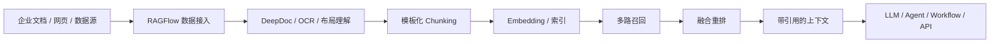
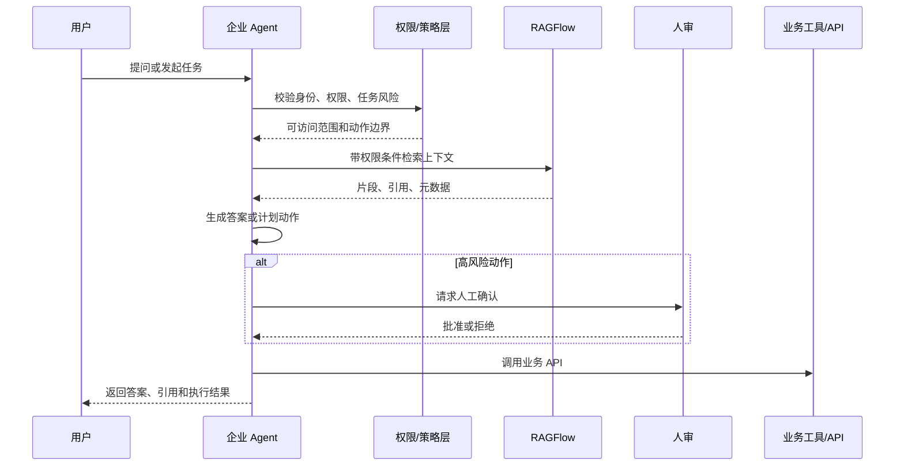

# RAGFlow：知识库终极引擎

日期：2026-05-12

来源视频：[RAGFlow：知识库终极引擎](https://www.youtube.com/watch?v=9x-9-r2ifig)

频道：huangyihe

发布时间：2024-08-23

时长：7:28

本地素材：

- 视频：`local-media/youtube/2026-05-12-ragflow-9x9-r2ifig/RAGFlow：知识库终极引擎 [9x-9-r2ifig].quicktime.mp4`
- 字幕：缺失
- 字幕说明：YouTube 未暴露标准字幕轨道；本次尝试了本地 `whisper.cpp` base/tiny ASR 和 60 秒分段 ASR，但未产出可用文本。`asr-chunks/` 中仅保留分段 wav 音频，不视为已校对字幕。
- 元数据：`local-media/youtube/2026-05-12-ragflow-9x9-r2ifig/RAGFlow：知识库终极引擎 [9x-9-r2ifig].quicktime.info.json`
- 关键画面抽帧：`local-media/youtube/2026-05-12-ragflow-9x9-r2ifig/frames/`
- 关键画面总览：`local-media/youtube/2026-05-12-ragflow-9x9-r2ifig/frames/contact-keyframes.jpg`
- 评论原始数据：`local-media/youtube/2026-05-12-ragflow-9x9-r2ifig/comments.json`
- 评论摘要素材：`local-media/youtube/2026-05-12-ragflow-9x9-r2ifig/comments-digest.md`

说明：`local-media/` 是本地沉淀目录，不应提交进 Git。

## 配套资源 / 代码地址

- 视频：<https://www.youtube.com/watch?v=9x-9-r2ifig>
- RAGFlow GitHub：<https://github.com/infiniflow/ragflow>
- RAGFlow v0.25.2 release：<https://github.com/infiniflow/ragflow/releases/tag/v0.25.2>
- 视频简介中的相关视频：<https://www.youtube.com/watch?v=LpWzvm_ZQ2U>、<https://www.youtube.com/watch?v=3GxhvbwHyKc>、<https://www.youtube.com/watch?v=g-KMmBWodOk>
- 社群链接：视频简介和置顶评论包含 YouTube 会员、Patreon、知识星球链接；这些不是技术资料，本笔记不展开。

## 评论区补充

- 已抓取 41 条评论。置顶评论主要是作者社群入口，没有技术补充。
- 高赞评论提出一个真实企业痛点：大量本地文档、深层目录、定期更新、增量分析和多语言文档管理。如果一个知识库系统只能手动 Web 上传文件，它对 6TB、40 多万个文档这种场景基本不可用。这个评论比“终极引擎”的标题更接近生产环境。
- 有评论认为 RAGFlow 的向量化质量较强，但系统要求高，不适合 NAS 等低资源环境。
- 有评论反馈 bug、PDF 解析、表格索引、镜像下载、稳定性等问题。这些不是个别小抱怨，而是企业 RAG 落地时必须验证的基本面。
- 作者在评论中建议个人学习场景优先考虑 NotebookLM，并说明自己视频里没有使用 Agent 功能，主要是直接问答。

## Fieldbook 归档判断

- 内容类型：工具观察
- 当前归档：`wiki/notes/`
- 是否值得升级为 lab：暂不升级
- 判断理由：这个视频适合作为 RAGFlow 产品观察入口，但本次没有完整字幕，也没有运行部署、API、工作流或评估实验。现在升级成 lab 会变成凭印象写脚本，坏品味。真正值得做的 lab 应该验证文档解析、批量导入、权限过滤、引用质量和 API 兼容性。
- 后续应进入：`wiki/research/open-source-projects/`，在做 RAGFlow 源码/部署/API 拆解时再升级。

## 一句话结论

RAGFlow 的价值不在“又一个聊天知识库界面”，而在把企业 RAG 中最容易烂掉的部分前置成产品能力：文档理解、可配置 chunking、引用、异构数据源、召回重排和工作流。但企业真正上线还缺权限治理、批量数据生命周期、评估集、人审和运维边界；这些不能靠一个漂亮 demo 自动消失。

## 视频时间轴

由于 YouTube 没有字幕、ASR 未产出可用文本，以下时间轴依据元数据、视频简介、关键帧和评论整理，不是逐句转写。

| 时间 | 主题 | 要点 |
|---|---|---|
| 00:00 | RAGFlow 定位 | 视频标题将 RAGFlow 称为“知识库终极引擎”，简介强调设置丰富，适合希望对知识库做深度配置的个人或团队。 |
| 01:04 | 知识库/助手设置 | 关键帧显示 RAGFlow 助手配置页，包含 Self-RAG、知识库选择、提示词等设置。 |
| 02:08 | 模型与供应商 | 关键帧显示模型供应商列表，说明它不是绑定单一模型的封闭工具。 |
| 03:12 | 文档解析配置 | 关键帧显示文档 chunk method、embedding model、layout recognition、page rank 等配置，重点在文档解析和索引前处理。 |
| 04:16 | 部署 | 画面字幕出现“通过 Docker 很容易就能完成部署”，但评论区也反馈镜像、资源和稳定性问题。 |
| 05:20 | Networking | 画面出现 Networking 转场，疑似进入网络/API/外部连接相关部分。 |
| 06:24 | 作者判断 | 画面字幕提到“这三页的设置”，视频更像快速产品观察，不是完整工程教程。 |

## 1. 视频说法：RAGFlow 是重配置的知识库引擎

从标题、简介和关键帧看，视频重点不是解释 RAG 原理，而是观察 RAGFlow 这个工具的产品面：

| 视频素材能确认的点 | 工程含义 |
|---|---|
| 设置丰富 | RAGFlow 不是只给一个上传文档再聊天的玩具界面，而是暴露较多 RAG 参数。 |
| 支持知识库选择 | 它把知识库作为一等对象，适合多资料集问答。 |
| 有 Self-RAG 开关 | 产品层面尝试把检索、反思或自校验能力配置化，但本次没有字幕，不能断言具体实现细节。 |
| 模型供应商列表较多 | 适合接不同 LLM/embedding provider，减少模型绑定。 |
| 文档解析设置较细 | 说明 RAGFlow 把 chunking、OCR/布局识别、索引参数作为核心卖点。 |
| Docker 部署 | 视频认为部署门槛不高，但评论区和当前官方要求都说明资源门槛不能忽略。 |

坏代码关心界面有多少按钮，好系统关心数据怎么进去、怎么切、怎么查、怎么证明答案来自哪里。RAGFlow 真正值得研究的是后者。

## 2. 当前事实：RAGFlow 的官方定位已经变宽

以下是 2026-05-12 归档时的当前官方校准事实，需要和 2024-08-23 视频说法分开看：

- 最新 GitHub release 是 `v0.25.2`，发布时间为 `2026-05-09T11:07:44Z`。
- README 当前称 RAGFlow 是融合 RAG 与 Agent 能力的开源 RAG engine/context layer。
- README 强调的关键能力包括 DeepDoc 深度文档理解、模板化 chunking、grounded citations、异构数据源、自动化 RAG workflow、可配置 LLM/embedding、多路召回加融合重排、API 集成。
- 自托管最低要求：CPU 4 cores、RAM 16GB、Disk 50GB、Docker 24、Docker Compose 2.26.1。
- 官方预构建镜像面向 x86；从 `v0.22` 起只发布 slim 镜像。
- `v0.25.2` release 强调 RESTful API 迁移并保持 legacy endpoint 兼容、8 类数据源删除文件同步快照，并修复元数据可见性、重复输出、Elasticsearch metadata filtering 性能问题。

这说明 RAGFlow 现在不只是“知识库问答工具”。它正在往企业 RAG 的 context layer 走：前面管数据和检索，后面给 Agent/workflow/API 使用。

## 3. RAGFlow 在企业 RAG 里的位置

企业 RAG 的核心不是“接一个大模型”，而是把非结构化资料变成可检索、可引用、可治理的上下文层。RAGFlow 适合放在这层。

这条链路里，RAGFlow 主要解决四件实际问题：

| 能力 | 对企业 RAG 的价值 |
|---|---|
| DeepDoc 深度文档理解 | PDF、扫描件、表格、图文混排文档如果解析烂了，后面召回再高级也没用。 |
| 模板化 chunking | 不同文档类型需要不同切分策略，不能一刀切。 |
| grounded citations | 答案必须能回到来源，否则企业用户不会信，也没法审计。 |
| 多路召回 + 融合重排 | 单一向量检索很容易漏召或误召，生产系统通常要混合检索和精排。 |

## 4. 适合企业直接借力的部分

RAGFlow 值得企业团队优先评估的，是那些“自己写很容易写烂”的底层能力。

1. 文档解析和 OCR：尤其是 PDF、表格、图片、扫描件、版面复杂的制度文件和技术手册。
2. Chunking 模板：不同资料类型按不同策略切片，保留标题、页码、章节和上下文。
3. 引用来源：把答案和证据绑定，减少“模型说了算”的黑箱感。
4. 异构数据源：从文件、网页或外部系统进入同一知识库链路。
5. LLM/embedding 可配置：企业可以按成本、合规、延迟和语言效果选择模型。
6. API 集成：让知识库能力被业务系统、Agent 或 workflow 调用，而不是只停留在 Web UI。

这部分自己从零造，不是不行，但大概率会先造出一个只会上传 PDF 的玩具。RAGFlow 至少把问题暴露在正确的层级上。

## 5. 企业仍然必须自己补的部分

别被“终极引擎”四个字骗了。RAGFlow 能做上下文层，不等于企业 RAG 就完成了。

| 缺口 | 为什么不能外包给工具 |
|---|---|
| 权限过滤 | 检索阶段就必须按用户权限过滤片段，不能等生成后再删。 |
| 数据治理 | 文档来源、版本、有效期、删除、审计、敏感信息都要有制度。 |
| 批量导入和增量同步 | 评论区最强痛点就是大量目录、多层文件、定期更新；这决定系统能不能进生产。 |
| 评估集 | 必须用真实问题评估召回率、引用正确性、答案忠实度和拒答能力。 |
| 人审机制 | 法务、财务、医疗、运维、付款、发邮件、改数据库等高风险动作必须有人审。 |
| 运维容量 | 官方最低 4C/16GB/50GB 只是门槛，不是企业大规模知识库的容量承诺。 |
| API 迁移管理 | v0.25.2 正在迁移 RESTful API，legacy endpoint 虽兼容，但调用方要管理版本边界。 |

权限是最容易被 demo 忽略、也是最不能错的地方。无权文档一旦被召回进上下文，后面让模型“不要泄露”就是废话。

## 6. 和 Agent 的关系

当前 README 已把 RAGFlow 描述为 RAG engine/context layer，并融合 Agent 能力。合理用法不是让 RAGFlow 变成所有业务逻辑，而是让它承担“上下文供应层”。

这才是干净的数据结构：Agent 负责任务编排，策略层负责边界，RAGFlow 负责上下文，业务系统负责真实状态和动作。把这些混成一个“超级知识库机器人”，迟早会失控。

## 工程提醒

1. 先验证文档解析，再谈 Agent。PDF、表格、图片和扫描件解析不稳定，Agent 只会把错误包装得更像真的。
2. 先设计权限元数据。文档、chunk、用户、部门、项目、密级必须能关联，否则企业 RAG 上线就是事故预备役。
3. 批量导入和增量同步是刚需。手动上传适合 demo，不适合真实企业知识库。
4. 引用不是装饰。答案必须能回到文档、页码、段落或原始数据源。
5. 评估集必须早做。没有召回率、引用正确性、幻觉率、拒答率，所谓“效果很好”就是感觉。
6. 高风险 Agent 动作必须有人审：发邮件、改数据库、付款、部署、执行 shell、账号权限变更，都不能只靠 RAG 自动决定。
7. 自托管资源别按最低配置规划。最低要求只说明能跑，不说明能支撑企业规模和并发。

## 工程判断

- 适合什么场景：文档类型复杂、需要引用来源、需要可配置检索链路、希望把 RAG 能力通过 API 接入业务系统的团队。
- 不适合什么场景：只想个人读几份 PDF、没有运维资源、不能接受调参和排障、缺少权限治理能力的团队。个人学习场景用 NotebookLM 可能更省事。
- 风险和边界：稳定性、资源占用、PDF/表格解析质量、批量目录同步、API 迁移、权限过滤、评估体系和人工审核都需要单独验证。

## 后续研究问题

- RAGFlow 的 DeepDoc 对不同类型 PDF、扫描件、表格、图片的解析准确率如何？
- RAGFlow 的 chunk template 如何表达文档结构？能否保留标题、页码、表格语义和层级目录？
- 多路召回和融合重排具体支持哪些策略？默认参数是否适合中文企业文档？
- RESTful API 迁移后，legacy endpoint 的兼容期和差异是什么？
- 数据源同步能否覆盖评论区提到的多层目录、增量更新、删除同步和大规模文件场景？
- 权限过滤是在检索前、检索中还是生成后做？能否做到 chunk 级权限？
- RAGFlow 作为 Agent context layer 时，如何接入追踪、评估和人审？

## 实验验证建议

- 要验证什么：RAGFlow 是否适合做企业 RAG 的上下文层，而不是只看 Web UI 是否漂亮。
- 最小实验形式：选 20 份混合文档，包括 PDF、扫描件、表格、Markdown、网页；准备 30 个真实问题和期望引用；部署 RAGFlow `v0.25.2`，测试导入、解析、chunk、召回、重排、引用和 API 查询。
- 重点指标：解析成功率、chunk 可读性、Top-K 召回率、引用正确率、无答案拒答率、批量导入耗时、资源占用、API 兼容性。
- 是否现在就做：否。本次是视频归档，且缺少完整字幕。等进入 `wiki/research/open-source-projects/` 做 RAGFlow 拆解时再升级为 lab。

## 参考资料

- 视频：<https://www.youtube.com/watch?v=9x-9-r2ifig>
- RAGFlow GitHub：<https://github.com/infiniflow/ragflow>
- RAGFlow v0.25.2 release：<https://github.com/infiniflow/ragflow/releases/tag/v0.25.2>
- 本地素材清单：`local-media/youtube/2026-05-12-ragflow-9x9-r2ifig/asset-manifest.md`
- 评论摘要：`local-media/youtube/2026-05-12-ragflow-9x9-r2ifig/comments-digest.md`

## 未验证事项

- 本笔记没有完整字幕依据；YouTube 未暴露字幕轨道，本地 ASR 没有产出可用文本，未逐句人工校对。
- 视频时间轴依据关键帧、视频简介、评论和元数据整理，不是精确逐句章节。
- 没有本地部署 RAGFlow，也没有运行 `v0.25.2`。
- 没有验证 DeepDoc、chunk template、grounded citations、多路召回、融合重排、API 迁移和数据源同步的实际效果。
- 没有验证评论区反馈的 bug、PDF 解析问题、镜像下载问题、表格 build index 报错和 NAS/边缘设备部署限制。
