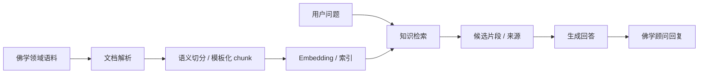
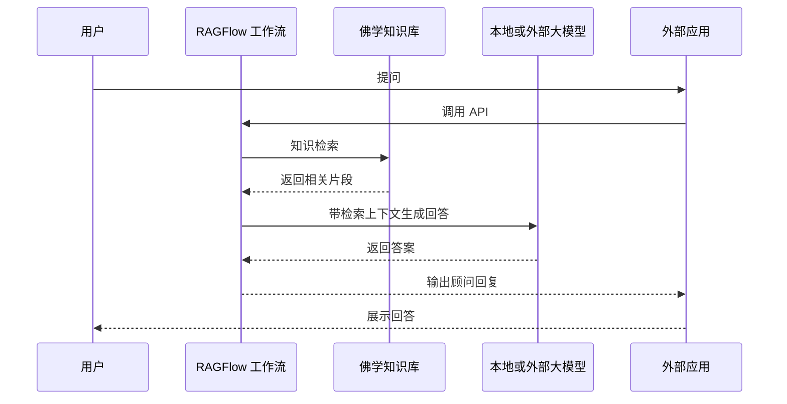
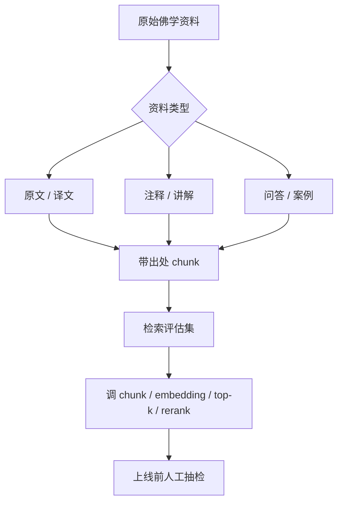

# RAGflow 知识库 + 参数可调架构 + 本地大模型，让 AI 化身佛学顾问

日期：2026-05-12

来源视频：[RAGflow知识库+参数可调架构+本地大模型 让AI化身佛学顾问](https://www.youtube.com/watch?v=8la6SQFJVhY)

频道：代码修理工

发布时间：2025-03-20

时长：00:03:09

本地素材：

- 视频：`local-media/youtube/2026-05-12-ragflow-8la6sqfjvhy/RAGflow知识库+参数可调架构+本地大模型 让AI化身佛学顾问 [8la6SQFJVhY].quicktime.mp4`
- 音频：`local-media/youtube/2026-05-12-ragflow-8la6sqfjvhy/audio-16k.wav`
- 元数据：`local-media/youtube/2026-05-12-ragflow-8la6sqfjvhy/RAGflow知识库+参数可调架构+本地大模型 让AI化身佛学顾问 [8la6SQFJVhY].quicktime.info.json`
- 关键画面抽帧：`local-media/youtube/2026-05-12-ragflow-8la6sqfjvhy/frames/contact-keyframes.jpg`
- 资产清单：`local-media/youtube/2026-05-12-ragflow-8la6sqfjvhy/asset-manifest.md`
- 字幕说明：YouTube 未暴露标准字幕轨；已尝试 `whisper.cpp` base 与 tiny ASR，但本轮未产出可用完整字幕。本文未逐句人工校对 ASR，不引用长字幕，只基于关键帧、元数据、用户提供的官方校准事实和视频可见流程整理。
- 评论摘要素材：`local-media/youtube/2026-05-12-ragflow-8la6sqfjvhy/comments-digest.md`

说明：`local-media/` 是本地沉淀目录，不应提交进 Git。

## 配套资源 / 代码地址

- 视频：https://www.youtube.com/watch?v=8la6SQFJVhY
- RAGFlow GitHub：https://github.com/infiniflow/ragflow
- RAGFlow v0.25.2 release：https://github.com/infiniflow/ragflow/releases/tag/v0.25.2
- 代码仓库：视频元数据简介为空，本轮也未抓到评论，因此未发现该佛学顾问案例的具体业务代码仓库地址。

## 评论区补充

未抓取到评论数据。本轮 capture 在 ASR 阶段卡住，未完成评论抓取，不能把评论区当作事实来源。

## Fieldbook 归档判断

- 内容类型：案例拆解 / 工具观察
- 当前归档：`wiki/notes/`
- 是否值得升级为 lab：暂不升级
- 判断理由：视频展示的是一个很窄的垂直场景：用 RAGFlow 把佛学语料做成可查询、可生成回答的顾问。它能说明“领域语料 + 检索 + 生成 + API 接入”的产品形态，但没有给出可复现代码、评估集、召回参数对比或失败案例。直接升 lab 会变成空跑界面，不会验证关键工程判断。
- 后续应进入：如果后续要研究 RAGFlow 参数调优，应进入 `wiki/labs/` 做最小实验；如果只是记录垂直知识库案例，保留在 `wiki/notes/` 即可。

## 一句话结论

这个视频的价值不在“佛学顾问”本身，而在展示一个窄领域 RAG 应用的最小闭环：把领域语料放进知识库，用知识检索约束回答，再通过 API 接到外部应用。别把它吹成通用企业方案。真正要落地，必须补上语料治理、chunk 策略、检索/重排参数、引用可追溯性、模型选择和评估集。

## 视频时间轴

| 时间 | 主题 | 要点 |
|---|---|---|
| 00:00-00:30 | 佛学知识库内容 | 画面显示 RAGFlow 中已有佛学文本条目，并在右侧展示检索/回答效果。 |
| 00:30-01:00 | 创建 Agent/工作流 | 进入工作流画布，开始把用户输入接到后续节点。 |
| 01:00-01:30 | 添加知识检索 | 可见知识检索节点，用知识库中的文档为用户找答案。 |
| 01:30-02:20 | 添加生成回答 | 在检索结果之后接入生成节点，让大模型基于知识库内容形成回答。 |
| 02:20-02:50 | API 接入 | 画面展示 API key 与 HTTP API，意图是把已搭好的顾问接入其他应用。 |
| 02:50-03:09 | 示例效果 | 展示问答/内容页面，证明这个窄场景能跑通体验闭环。 |

## 1. 这个案例真正的数据结构

这里的核心数据不是“佛学顾问”这个包装名，而是四类东西：

1. 领域语料：佛学文本、问答素材、解释性段落。
2. 索引单元：经过解析、切分、向量化后的 chunk。
3. 检索结果：用户问题命中的若干文本片段及其来源。
4. 生成回答：大模型基于检索结果组织出的自然语言答案。

数据结构要是错了，后面加再多提示词都是补丁。佛学文本常见问题是概念密集、上下文依赖强、术语有宗派差异。粗暴按固定长度切 chunk，很容易把一个概念的定义、出处和解释切散，最后模型只会拼碎片。

好品味在这里很简单：先把语料和 chunk 搞对，再谈 Agent。否则所谓“顾问”只是一个带检索按钮的聊天壳。

## 2. 视频说法：用 RAGFlow 组一个窄领域顾问

从关键帧看，视频流程大致是：

1. 准备佛学相关文档，并放入 RAGFlow 知识库。
2. 在工作流/Agent 画布中接收用户输入。
3. 添加知识检索节点，从知识库中查找相关内容。
4. 添加生成回答节点，让大模型基于检索结果回答。
5. 创建 API key，通过 HTTP API 接入其他应用。

这个设计适合“可控语料范围内的解释型问答”。它不等于通用智能顾问，更不等于企业知识管理完整方案。佛学文本只是示例语料，场景边界非常窄。

## 3. 参数调优应该盯哪些地方

视频标题提到“参数可调架构”，但没有可复现的参数实验。真正有工程意义的参数不是 UI 上随手拖一拖，而是要围绕召回质量和回答可信度来调：

| 参数层 | 关键问题 | 调错后的表现 |
|---|---|---|
| 文档解析 | 原文结构、段落、标题、引用是否保留 | 答案断章取义，来源不可追溯 |
| chunk 策略 | 按章节、语义段、问答对还是固定长度切分 | 召回碎片化，术语解释丢上下文 |
| embedding 模型 | 是否适合中文和佛学术语 | 相近概念召不回，或召回一堆泛泛段落 |
| top-k / 阈值 | 召回多少片段进入生成 | 太少则漏答，太多则噪声污染回答 |
| rerank | 是否重排候选片段 | 命中文档但排序靠后，生成阶段用错上下文 |
| 生成模型 | 本地模型是否能稳定遵循引用材料 | 自说自话、过度发挥、把宗教概念讲错 |
| prompt 约束 | 是否要求“不知道就说不知道”、引用来源 | 模型编造出处或把解释说成定论 |

这里的原则很朴素：先调检索，再调生成。召回错了，生成模型越强，胡说得越像真的。

## 4. 本地大模型的边界

本地模型的优势是数据不出本机、部署可控、成本可预测。佛学语料这种窄领域文本，本地模型可以承担“基于材料复述、归纳、解释”的任务。

但本地模型不是免费午餐：

- 小模型容易把相近概念混在一起，尤其是佛学术语、经典名词、宗派解释。
- 中文长上下文能力不稳定时，检索片段多了反而答得更乱。
- 如果没有引用约束，模型会把“检索到的材料”和“自己预训练里的说法”混在一起。
- 如果要接入外部应用，API key、访问控制、日志、隐私边界都要管。

所以这个案例可以用本地模型，但回答策略应保守：优先引用知识库内容，无法从语料支持的部分直接说明“不确定”。

## 5. RAGFlow 当前官方事实校准

下面是“当前事实”，不是视频在 2025-03-20 发布时必然覆盖的内容。

| 项目 | 当前事实 |
|---|---|
| 最新 release | GitHub 最新 release 是 `v0.25.2`。GitHub API 发布于 `2026-05-09T11:07:44Z`，官方 release notes 写 `Released on May 11, 2026`。 |
| 官方定位 | README 当前称 RAGFlow 是融合 RAG 与 Agent 能力的开源 RAG engine/context layer。 |
| 关键特性 | DeepDoc 深度文档理解、模板化 chunking、grounded citations、异构数据源、自动化 RAG workflow、可配置 LLM/embedding、多路召回加融合重排、API 集成。 |
| 自托管最低要求 | CPU 4 cores、RAM 16GB、Disk 50GB、Docker 24、Docker Compose 2.26.1。 |
| 镜像限制 | x86 预构建镜像；从 v0.22 起只发布 slim 镜像。 |
| v0.25.2 重点 | RESTful API 迁移并保持 legacy endpoint 兼容；8 类数据源删除文件同步快照；修复元数据可见性、重复输出、ES metadata filtering 性能问题。 |

这层校准很重要。视频展示的是一个短案例，当前官方事实说明 RAGFlow 已经不只是“知识库问答 UI”，而是向 RAG + Agent context layer 演进。两者不能混成一句话，否则笔记就失真。

## 6. 领域语料处理建议

佛学顾问这种窄场景，真正麻烦的不是界面，是语料。

1. 保留出处：经典、译本、章节、段落位置必须能追踪。没有出处的回答，在这个领域基本不可用。
2. 区分材料类型：原文、译文、注释、现代解释、问答整理不要混成一种 chunk。
3. 控制解释口径：同一概念可能有不同解释传统，知识库需要标注来源，不要让模型合成一个看似权威的“总说法”。
4. 构建小评估集：准备常见概念题、出处题、比较题、拒答题，用来调 chunk、top-k、rerank 和 prompt。
5. 明确拒答边界：涉及修行建议、宗教判断、心理危机、医疗建议时，不能让系统装专家。

## 工程提醒

1. 高风险动作要有人审：如果顾问接入外部应用，文件写入、shell、数据库、账号操作、邮件和支付都不能自动放权。
2. API key 不是装饰品：视频画面显示 API key/API 接入，真实项目必须做权限隔离、轮换、日志脱敏。
3. 引用必须可见：RAG 的价值在 grounded citations。没有来源的“佛学解释”很容易变成幻觉。
4. 评估集比演示更重要：三分钟 demo 只能证明流程跑通，不能证明答案可靠。
5. 不要一上来多 Agent：这个案例单 Agent/单工作流已经够了。先把检索、状态、追踪和评估做实。

## 工程判断

- 适合什么场景：垂直领域材料相对稳定、用户问题集中、回答需要基于内部语料的解释型问答，例如课程资料问答、手册问答、特定主题资料库。
- 不适合什么场景：需要强实时性、强推理、跨系统自动执行、法律/医疗/投资/宗教权威判断的场景。尤其佛学顾问只能作为资料检索和解释辅助，不能包装成权威导师。
- 风险和边界：语料切分不当会污染召回；本地模型可能混淆术语；没有引用就无法审计；没有评估集就无法判断参数调优是否有效；API 接入后还会带来权限和隐私问题。

【品味评分】
🟡 凑合。视频展示了能跑通的最小闭环，但缺少参数对比、评估和失败案例。作为入门案例可以，作为工程方案还不够。

【致命问题】
- 没有证明“参数可调”带来了可量化提升。
- 没有展示语料结构、chunk 策略、召回命中率、引用质量。
- 没有说明本地模型的能力边界和拒答策略。

【改进方向】
- 先把语料分层和出处字段设计清楚。
- 用 20-50 个佛学领域测试问题做检索/回答评估。
- 比较不同 chunk、top-k、rerank、embedding、本地模型组合。
- 输出答案时强制显示引用来源和不确定性。

## 后续研究问题

- RAGFlow 的 DeepDoc 对中文长文、古文、扫描 PDF 的解析质量如何？
- 模板化 chunking 能否表达“原文-译文-注释-现代解释”的层次关系？
- 本地 embedding 模型在佛学术语上的召回质量是否足够？
- v0.25.2 RESTful API 迁移后，旧 API 接入方式还有哪些兼容边界？
- 删除文件同步快照、元数据可见性修复，对企业知识库权限和审计有什么影响？

## 实验验证建议

- 要验证什么：不同 chunk 策略和 rerank 配置对佛学问答召回质量的影响。
- 最小实验形式：准备 5-10 篇佛学文本、20 个问题、一个固定本地模型，对比固定长度 chunk、标题层级 chunk、问答对 chunk；记录命中片段、引用来源、回答是否被材料支持。
- 是否现在就做：否。本视频没有足够实验材料和完整字幕。先归档为案例，后续如果要研究 RAGFlow 参数调优，再单独建 lab。

## 参考资料

- 视频：[RAGflow知识库+参数可调架构+本地大模型 让AI化身佛学顾问](https://www.youtube.com/watch?v=8la6SQFJVhY)
- RAGFlow GitHub：https://github.com/infiniflow/ragflow
- RAGFlow v0.25.2 release：https://github.com/infiniflow/ragflow/releases/tag/v0.25.2

## 未验证事项

- 本轮没有可用完整字幕；`whisper.cpp` base 与 tiny ASR 均未在合理时间内产出最终字幕文件，因此本笔记未逐句人工校对 ASR。
- 未抓取到评论数据，未验证置顶评论、作者回复或评论区代码链接。
- 未运行 RAGFlow，也未复现视频中的佛学顾问工作流。
- 未验证视频中的 API 接入是否仍适配 RAGFlow v0.25.2；这里只记录当前官方事实中“RESTful API 迁移并保持 legacy endpoint 兼容”的校准信息。
- 未验证具体本地模型、embedding 模型、chunk 参数、top-k、rerank 参数的效果。
- 佛学回答质量没有经过领域专家审校，不能把本案例包装成权威宗教咨询产品。

