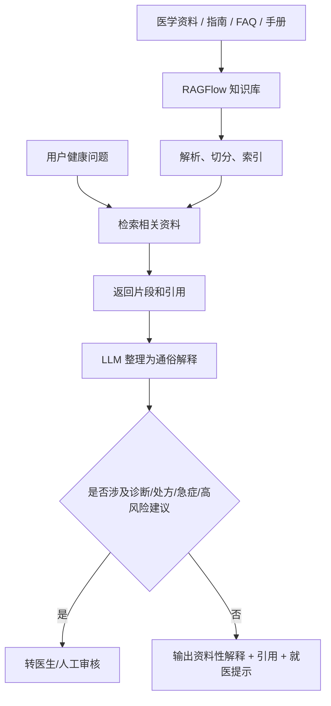
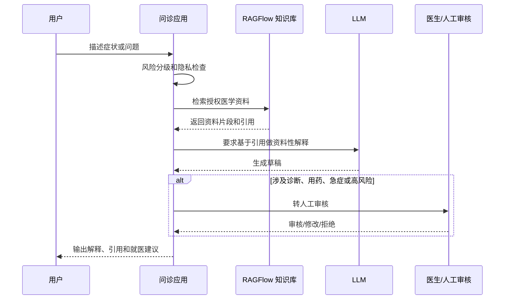

# 用 RAGFlow 打造 AI 医疗问诊助手

日期：2026-05-12

来源视频：[【2026最新】用RAGFlow打造AI医疗问诊助手竟这么简单？从知识库构建到智能诊断全流程揭秘，解决90%医疗咨询难题，让你的工作效率翻倍！AI大模型|LLM](https://www.youtube.com/watch?v=-LWFrIoQ5V4)

频道：AI大模型小冉Agent

发布时间：2026-04-14

时长：31:47

本地素材：

- 视频：`local-media/youtube/2026-05-12-ragflow-lwfrioq5v4/【2026最新】用RAGFlow打造AI医疗问诊助手竟这么简单？从知识库构建到智能诊断全流程揭秘，解决90%医疗咨询难题，让你的工作效率翻倍！AI大模型｜LLM [-LWFrIoQ5V4].quicktime.mp4`
- 音频：`local-media/youtube/2026-05-12-ragflow-lwfrioq5v4/audio-16k.wav`
- 元数据：`local-media/youtube/2026-05-12-ragflow-lwfrioq5v4/【2026最新】用RAGFlow打造AI医疗问诊助手竟这么简单？从知识库构建到智能诊断全流程揭秘，解决90%医疗咨询难题，让你的工作效率翻倍！AI大模型｜LLM [-LWFrIoQ5V4].quicktime.info.json`
- 关键画面抽帧：`local-media/youtube/2026-05-12-ragflow-lwfrioq5v4/frames/`
- 关键画面总览：`local-media/youtube/2026-05-12-ragflow-lwfrioq5v4/frames/contact-keyframes.jpg`
- 字幕说明：YouTube 未暴露可用字幕轨道；worker 曾尝试本地 ASR 但未在截止时间内完成。本文只基于元数据、关键帧和当前官方事实整理，不做逐句视频断言。

说明：`local-media/` 是本地沉淀目录，不应提交进 Git。

## 配套资源 / 代码地址

- 视频：https://www.youtube.com/watch?v=-LWFrIoQ5V4
- RAGFlow GitHub：https://github.com/infiniflow/ragflow
- RAGFlow v0.25.2 release：https://github.com/infiniflow/ragflow/releases/tag/v0.25.2
- 代码仓库：视频简介和元数据中未发现该医疗问诊案例的专属代码仓库地址。
- 其他资料：视频简介提到学习路线、实战项目、电子书和面试真题，但没有给出可直接归档的技术资料 URL。

## 评论区补充

本次没有抓到可用评论摘要。不能用评论区作为技术事实来源。

## Fieldbook 归档判断

- 内容类型：案例拆解 / 风险边界观察
- 当前归档：`wiki/notes/`
- 是否值得升级为 lab：暂不升级
- 判断理由：医疗问诊是高风险场景。没有字幕、没有源码、没有医学知识库来源、没有评估集、没有医生审核流程、没有合规说明，就不应进入“复现实验”。如果未来要做 lab，也只能做“医疗资料检索助手的拒答和引用边界验证”，不能做自动诊断系统。
- 后续应进入：若继续研究，应放入 `wiki/research/use-cases/medical-rag-risk-boundary.md`，先做风险拆解，不直接做产品实验。

## 一句话结论

这个视频只能作为“RAGFlow 医疗资料检索助手”的流程观察，不能当真实医疗落地范式。医疗场景里，RAGFlow 最多帮助检索和引用医学资料；诊断、处方、治疗建议、分诊结论必须有医生审核、合规边界、临床验证和责任归属。标题里的“解决90%医疗咨询难题”没有评测证据，本笔记不承认它是事实。

## 视频素材能确认什么

由于缺少字幕，以下只依据元数据和关键帧做低风险归纳：

| 画面时间 | 可见内容 | 可确认要点 |
|---|---|---|
| 02:00 | RAGFlow/知识库流程图类画面，字幕提到检索相关文档 | 视频主题包含用 RAGFlow 从知识库中检索医疗相关资料。 |
| 08:00 | 浏览器中打开项目/工具页面，字幕提到安装所需工具 | 视频包含环境准备或工具安装步骤。 |
| 16:00 | 文件目录和配置文件，字幕提到“已经配置完成” | 视频包含本地配置或部署步骤。 |
| 24:00 | 浏览器/终端相关画面 | 视频后段可能演示启动、访问或运行效果。 |

这些画面不足以证明医疗问诊质量、诊断准确率或临床可用性。

## 技术流程抽象

医疗问诊类 RAG demo 通常会被包装成“AI 医生”，但从工程角度只能拆成资料检索链路：

好的结构是：RAGFlow 管资料检索和引用，LLM 只做通俗解释，高风险判断交给医生。坏结构是：把用户症状扔给模型，让模型直接诊断和开建议。

## 医疗场景的硬边界

医疗不是普通 FAQ。下面这些边界不满足，就不要谈上线：

1. 医学资料来源必须可审计：指南版本、发布日期、适用地区、审核医生、过期时间都要记录。
2. 回答必须有引用：没有出处的医学建议不应输出为可信结论。
3. 必须拒答或转人工：急症、用药、剂量、孕产、儿童、慢病、精神心理、自伤风险、诊断结论都不能自动给最终建议。
4. 必须有医生审核：尤其是对外服务、付费咨询、诊疗建议、分诊建议。
5. 必须处理隐私合规：健康信息属于敏感数据，日志、向量库、缓存、第三方模型 API 都要纳入合规设计。
6. 必须做临床/专家评估：不能只用 demo 问答证明可用。

## 当前 RAGFlow 官方事实校准

截至 2026-05-12：

- GitHub 最新 release 是 `v0.25.2`。
- GitHub API 显示 `v0.25.2` 发布于 `2026-05-09T11:07:44Z`；官方 release notes 写 Released on May 11, 2026。
- README 当前称 RAGFlow 是融合 RAG 与 Agent 能力的开源 RAG engine/context layer。
- 关键特性包括 DeepDoc 深度文档理解、模板化 chunking、grounded citations、异构数据源、自动化 RAG workflow、可配置 LLM/embedding、多路召回加融合重排、API 集成。
- 自托管最低要求：CPU 4 cores、RAM 16GB、Disk 50GB、Docker 24、Docker Compose 2.26.1。
- 官方预构建镜像面向 x86；从 `v0.22.0` 起只发布 slim edition。
- `v0.25.2` release 重点：RESTful API 迁移并保持 legacy endpoint 兼容；8 类数据源删除文件同步快照；修复元数据可见性、重复输出、Elasticsearch metadata filtering 性能问题。

这些事实说明 RAGFlow 适合作为资料上下文层候选，但不能自动补齐医疗合规和临床验证。

## 工程判断

- 适合什么场景：医学资料检索、指南摘要、内部客服知识库、医生助理草稿、患者教育材料检索。
- 不适合什么场景：自动诊断、自动处方、自动分诊、急症建议、替代医生、面向患者直接给治疗决策。
- 风险和边界：医疗数据敏感；LLM 可能幻觉；引用可能不支持结论；资料可能过期；用户可能把资料性解释当诊断；第三方模型 API 可能导致隐私泄漏。

【核心判断】

❌ 不值得直接做成“AI 医疗问诊助手”产品：这是高风险场景，标题过满，没有评测和合规证据。

✅ 值得研究的是“医疗资料 RAG 的边界”：如何基于可信资料检索、引用、拒答、转人工。

【关键洞察】

- 数据结构：医学资料必须有来源、版本、适用范围、审核人、有效期和引用位置。
- 复杂度：真正复杂的是风险分级、权限、隐私、审核和评估，不是把 RAGFlow 页面跑起来。
- 风险点：把资料检索回答包装成诊断建议，这是医疗 RAG 最大的坏味道。

## 后续研究问题

- RAGFlow 是否能稳定保留医学指南的章节、表格、剂量、禁忌、适用人群和发布日期？
- grounded citations 是否真的支持医学回答中的每个关键结论？
- 如何实现高风险问题分类和自动转人工？
- 健康信息进入向量库、日志、缓存、第三方模型 API 后如何做隐私合规？
- 医疗资料更新、撤回、过期后，索引和历史引用如何同步？
- 如何构建医学 RAG 评估集，分别测召回、引用支持、拒答和风险分级？

## 实验验证建议

- 要验证什么：RAGFlow 作为“医学资料检索助手”的引用和拒答边界。
- 最小实验形式：选公开医学科普资料或公开指南摘要，构造 30 个问题，包含普通科普、无答案、急症、用药剂量、儿童/孕妇、诱导诊断等类别。
- 验收标准：资料性问题必须引用来源；无依据问题拒答；诊断/处方/急症问题转人工或建议立即就医；不输出确定性治疗结论。
- 是否现在就做：否。本次只是视频归档；医疗场景应先做风险研究，不直接写产品实验。

## 参考资料

- 视频：https://www.youtube.com/watch?v=-LWFrIoQ5V4
- 本地素材目录：`local-media/youtube/2026-05-12-ragflow-lwfrioq5v4/`
- RAGFlow GitHub：https://github.com/infiniflow/ragflow
- RAGFlow v0.25.2 release：https://github.com/infiniflow/ragflow/releases/tag/v0.25.2

## 未验证事项

- 没有可用字幕；未逐句人工校对视频内容。
- 没有抓取到可用评论摘要。
- 没有运行 RAGFlow，也没有复现医疗问诊流程。
- 没有验证视频标题中的“解决90%医疗咨询难题”。
- 没有医学专家审核本笔记中的场景判断。
- 没有验证任何诊断、用药、分诊或治疗建议能力。本笔记只讨论工程风险边界。
