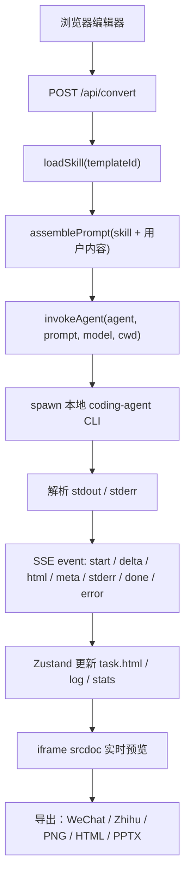

# HTML Anything 调研报告：本地 Agent 驱动的 HTML 交付编辑器

调研日期：2026-05-15  
调研对象：https://github.com/nexu-io/html-anything  

调研口径：

- 一手来源：GitHub 仓库 README、README.zh-CN、package.json、源码、issues、PR。
- 仓库状态：通过 GitHub CLI / GitHub API 抓取，数据时间为 2026-05-15 13:06 CST 左右。
- 本报告没有做本地 `pnpm install`、`pnpm build`、端到端生成、Windows 复现或安全测试。没有验证就不装作验证过。

## 核心判断

HTML Anything 值得研究，但不能直接当生产级基础设施依赖。

它不是空壳。仓库里确实有完整的 Next.js 应用、agent CLI 检测、SSE 流式转换、75 个 skill 模板、iframe 预览、公众号 / 知乎 / PNG / HTML 等导出路径。它的产品切口也很清楚：既然 Agent 已经能写文档，就不要再把 Markdown 当最终交付物，而是让本地 Agent 直接生成可发布的单文件 HTML。

但它现在最大的风险也很清楚：浏览器里的一个请求可以触发本机已登录的 coding-agent CLI 子进程，而这些 CLI 还带着 `bypassPermissions`、`--yolo`、`--allow-all-tools`、`--dangerously-skip-permissions` 这类参数。这个信任边界太粗。项目适合本地可信实验，不适合原样部署给多人或公网使用。

一句话：

> 方向对，代码不是玩具，但安全边界和失败语义还停在早期原型阶段。

## 基本信息

| 项目 | 信息 |
|---|---|
| 仓库 | `nexu-io/html-anything` |
| URL | https://github.com/nexu-io/html-anything |
| 创建时间 | 2026-05-11 09:40:38 UTC |
| 最近 push | 2026-05-15 04:06:10 UTC |
| Stars / Forks | 约 1270 / 142 |
| Issues | 5 个 open issues |
| License | Apache-2.0 |
| Latest release | 无 |
| 主要语言 | GitHub 识别为 HTML |
| 包发布 | `package.json` 为 `private: true`，npm registry 未查到 `html-anything` 包 |
| 核心技术栈 | Next.js 16、React 19、Tailwind 4、Zustand、TypeScript |

`package.json` 只有三个脚本：

```json
{
  "scripts": {
    "dev": "next dev",
    "build": "next build",
    "start": "next start"
  }
}
```

没有 test 脚本，没有 CI workflow。这个事实比 README 的热闹更重要。

## 它到底在做什么

HTML Anything 的核心不是“HTML 编辑器”。真正的核心是：

> 把用户已经登录好的本地 coding-agent CLI，当作文档渲染引擎，用 prompt + skill 约束它输出单文件 HTML。

输入可以是 Markdown、CSV、Excel、JSON、SQL、纯文本、图片等。用户选择一个 skill 模板后，前端把内容发给 `/api/convert`，服务端调用本地 agent CLI，agent 输出 HTML，浏览器用 iframe 实时预览，然后导出到各个平台。

README 里宣传的 75 个 skill 和 9 类交付场景，经本地克隆检查，`src/lib/templates/skills/` 下确实有 75 个 skill 文件夹。每个 skill 基本是 `SKILL.md + example.html`，有些还带 `example.md`。

## 数据结构分析

这个项目的数据结构比很多“AI 工具”项目好。它没有一上来搞多 Agent、工作流图、插件市场那套复杂东西，而是把系统拆成几类稳定对象。

### AgentDef

位置：`src/lib/agents/detect.ts`

`AgentDef` 描述一个本地 CLI：

- `id`：例如 `claude`、`codex`、`gemini`、`opencode`。
- `bin` / `fallbackBins`：如何在 PATH 上找到它。
- `protocol`：prompt 走 stdin、argv、argv-message，还是暂未接入的 ACP / pi-rpc。
- `fallbackModels`：UI 上展示的模型列表。
- `envOverride`：通过环境变量覆盖二进制路径。

这是正确的数据结构。不同 Agent 的差异先收敛到定义层，而不是散落在组件里。

### Skill

位置：`src/lib/templates/loader.ts`、`src/lib/templates/skills/*`

一个 skill 是一个文件夹：

```text
src/lib/templates/skills/<id>/
├── SKILL.md
├── example.html
└── example.md     # 可选
```

`loader.ts` 扫描目录、解析 frontmatter、返回 picker 需要的元数据。新增 skill 不需要改 TypeScript 注册表。这是有好品味的设计：能力扩展落在文件系统结构里，复杂度低。

### Task

位置：`src/lib/store.ts`

`Task` 是用户一次转换任务：

- 输入：`content`、`format`、`filename`、`templateId`。
- 输出：`html`、`status`、`log`、`stats`。
- diff-edit 基线：`baseContent`、`baseHtml`。
- 附件：`assets`，图片先以 `asset:<id>` 留在编辑器里，调用 agent 前再替换为 data URL。

这套数据结构基本合理。它把“用户内容”“生成结果”“运行日志”“统计信息”放在同一个任务对象里，方便多任务并发和历史恢复。

## 执行链路



核心路径很短。这是好事。短路径容易理解、容易 debug。

坏消息是：这个短路径里直接包含 `spawn()`。HTTP route 和本地执行器之间缺少足够硬的边界。

## 关键模块拆解

### 1. Agent 检测与调用

相关文件：

- `src/lib/agents/detect.ts`
- `src/lib/agents/argv.ts`
- `src/lib/agents/invoke.ts`
- `src/app/api/agents/route.ts`
- `src/app/api/convert/route.ts`

检测逻辑会扫描 PATH，以及 `~/.local/bin`、`~/.bun/bin`、`/opt/homebrew/bin`、`~/.npm-global/bin` 等常见目录。检测到的 agent 会显示在 UI 顶栏。

调用逻辑集中在 `buildArgv()`：

- Claude：`claude -p --output-format stream-json --permission-mode bypassPermissions`
- Codex：`codex exec --json --sandbox workspace-write`
- Gemini：`gemini --output-format stream-json --yolo`
- Copilot：`copilot --allow-all-tools --output-format json`
- OpenCode：`opencode run --format json --dangerously-skip-permissions`
- Qwen：`qwen --yolo`
- Aider：`aider --no-pretty --no-stream --yes-always --message-file -`

这就是项目最有价值、也最危险的地方。

有价值，是因为它复用用户已有登录态，不需要 API key，也不需要自己做模型网关。

危险，是因为这些参数绕过了不少交互确认。对可信本地实验可以接受；对多人服务、公网服务、敏感目录，不能接受。

### 2. Skill 注册与模板系统

相关文件：

- `src/lib/templates/loader.ts`
- `src/lib/templates/shared.ts`
- `src/lib/templates/skills/*/SKILL.md`

`shared.ts` 会给所有 skill 拼上统一约束，例如：

- 输出自包含单文件 HTML。
- 不要用 markdown 围栏。
- 不要使用 Write / Edit / Bash / 文件系统工具。
- 必须使用真实用户数据。
- 中文优先字体栈、8px 网格、对比度、不要 lorem ipsum。

这条路线是对的：把共性约束统一收口，再让每个 skill 只表达自己的设计系统和版式规则。

但 prompt 约束不是安全边界。项目最近的 PR #9 / #11 就是为了解决 agent 不听话、把 HTML 写到文件里，导致预览拿到“已输出至 …”这种闲聊文本的问题。现在代码通过 `rescueHtmlFromToolUse()` 从 Write 工具输入里抢救 HTML。这个修补很实用，但也说明 agent 输出协议并不稳定。

### 3. SSE 流式转换

相关文件：

- `src/app/api/convert/route.ts`
- `src/lib/agents/invoke.ts`
- `src/lib/use-convert.ts`

服务端把 agent stdout 解析成事件，通过 SSE 发给浏览器。客户端按事件更新状态：

- `start`：记录启动命令和 prompt bytes。
- `delta`：append 到 HTML。
- `html`：从工具调用中恢复完整 HTML，替换已有输出。
- `meta`：记录模型、usage、cost、duration 等。
- `stderr` / `raw`：写日志。
- `done`：记录进程退出。
- `error`：写错误日志。

这个事件模型简单，够用。

问题是失败状态处理不干净。客户端读完 SSE 后会设置 `status = done`，而 `done` event 只是把 exit code 写日志。如果 agent exit 非 0，但 fetch 正常结束，UI 仍可能进入 done。日志知道失败，状态装作成功，这是坏味道。

### 4. 预览与导出

相关文件：

- `src/components/preview-pane.tsx`
- `src/lib/extract-html.ts`
- `src/lib/export/wechat.ts`
- `src/lib/export/image.ts`
- `src/lib/export/zhihu.ts`
- `src/lib/export/deck.ts`

预览用 iframe：

```tsx
<iframe
  srcDoc={display}
  sandbox="allow-scripts allow-same-origin"
/>
```

这能隔离宿主页面样式污染，也方便渲染单文件 HTML。

但 `allow-scripts` + `allow-same-origin` 不是强安全沙箱。对不可信 HTML，这个组合需要非常谨慎。README 说“沙箱预览”，这句话不能当安全承诺。它更像是 UI 隔离，不是安全隔离。

导出层比较实用：

- 公众号：用 `juice` 内联 CSS。
- PNG：用 `modern-screenshot` 截 iframe。
- 知乎：处理数学公式占位。
- HTML：直接下载单文件。
- Deck：导出 PPTX / zip 等。

这部分值得学。它解决的是实际发布问题，不是为了炫技术。

## 品味评分

🟡 凑合，偏好品味。

好的地方：

- Skill 文件夹模型简单，扩展成本低。
- Agent adapter 集中在 `detect.ts / argv.ts / invoke.ts`，没有撒满前端组件。
- SSE 事件模型没有过度设计。
- 用本地 CLI 复用登录态，避开自建模型代理和 API key 管理，产品切口实际。
- diff-edit 模式用已有 `baseHtml + baseContent` 做最小修改，避免每次重生成导致设计漂移。

差的地方：

- 本地执行边界太松。
- 失败状态与日志不一致。
- iframe sandbox 表述过强。
- 没有 CI、没有测试、没有 release。
- 文档增长太快，README、PROGRESS、代码里的 agent 数量口径已经有漂移。
- 贡献文档要求 vendor skill 保留 LICENSE 和署名，但当前 skill 目录下没有看到独立 LICENSE / NOTICE 文件。

## 致命风险

### 1. `/api/convert` 可以触发本机进程

`/api/convert` 接受请求体：

```ts
type Body = {
  agent: string;
  templateId: string;
  content: string;
  format?: string;
  model?: string;
  cwd?: string;
  editFromHtml?: string;
  editFromContent?: string;
};
```

然后把 `cwd` 传给 `invokeAgent()`，最终进入：

```ts
spawn(bin, argv, {
  cwd: opts.cwd ?? process.cwd(),
  env,
  stdio: ["pipe", "pipe", "pipe"],
});
```

这不是小问题。请求体不应该决定本地 agent 在哪个目录执行。至少要做 allowlist，最好固定 workspace。

### 2. Agent 参数默认偏“放权”

为了减少交互确认，它使用了很多危险参数：

- `bypassPermissions`
- `--yolo`
- `--allow-all-tools`
- `--dangerously-skip-permissions`
- `--yes-always`

这能让 demo 顺滑，也会让误用更危险。项目应该把这些模式显式标成“高信任本地模式”，而不是把它们包装成普通转换。

### 3. 预览 HTML 不是安全边界

生成的 HTML 可以包含脚本、CDN、字体、动画。iframe 确实隔离了一部分污染，但 `allow-scripts allow-same-origin` 这个组合不是硬沙箱。真正要处理不可信 HTML，应该使用独立 origin，或者去掉 `allow-same-origin`，再重新设计截图和导出桥接。

### 4. 成熟度不足

当前 open issues 里有：

- #16：Windows 上生成 HTML 时 agent 调用立即失败，`spawn EINVAL`。
- #15：Windows 10 环境提示无效参数。
- #13：agent binary path 自动检测不正确，缺少手动覆盖方式。
- #12：希望直接部署生成网页到 surge.sh。
- #10：git clone 异常。

打开的 PR 里有：

- #17：修 agent bin path override、envOverride、Windows shell launch。
- #14：harden agent conversion and localize fonts。
- #18：新增 Product Hunt launch card skill。

这说明项目还在快速补基础设施问题。现在别把它当稳定平台。

## 值得学习

### 1. 本地 CLI 复用登录态

这是项目最值得学的点。很多 AI 应用一上来就做 API key、模型代理、账单、配额。HTML Anything 反过来：你已经登录了 Claude Code / Codex / Gemini / Cursor，就直接复用它。

这符合本仓库的一个研究原则：先把单 Agent、工具调用、状态、追踪做好，不要一上来做多 Agent。

### 2. Skill 文件夹就是插件

它没有搞复杂插件协议，而是用文件夹表达能力：

```text
SKILL.md + example.html + optional assets/references
```

这很适合我们后续沉淀自己的 Agent Skill：先把示例输出、硬约束、失败边界写清楚，再考虑工具化。

### 3. Prompt 约束要有共享层

`SHARED_DESIGN_DIRECTIVES` 把所有模板共通要求集中到一处。这个模式可以复用到本仓库的视频笔记、资料摘要、开源项目拆解等 Skill 中。

### 4. 输出即交付

“Markdown 是草稿，HTML 是成品”这个判断有现实价值。很多学习笔记和调研报告如果最终要给人看，只停在 Markdown 其实不够。HTML / PNG / PDF / PPTX 等交付面值得研究。

### 5. 日志和指标对用户可见

项目在 UI 里显示 elapsed、TTFB、size、chunks、tokens、model、cost 等。Agent 产品不应该只给一个转圈动画。用户需要看到过程、成本和失败原因。

## 不值得学

### 1. 不要照搬默认放权参数

为了流畅演示而跳过权限确认，是产品 demo 的捷径，不是工程默认值。

### 2. 不要把 prompt 当安全边界

“禁止使用 Write / Bash”写在 prompt 里有用，但不可靠。项目自己也已经遇到 agent 继续 Write 文件的问题。

### 3. 不要把 iframe sandbox 讲成绝对安全

UI 隔离和安全隔离是两回事。这个概念不能混。

### 4. 不要在没有测试的情况下快速堆 adapter

多 CLI adapter 的失败面很宽。Claude、Codex、Gemini、OpenClaw、Aider 的输出协议都不一样。没有 parser 测试和回归样例，后续一定会靠 issue 驱动修 bug。

## 可复刻的最小版本

如果我们要在本仓库复刻一个最小实验，不应该复刻 75 个 skill，也不应该接 17 个 agent。先做最小闭环：

```text
输入 Markdown
  -> 选择 1 个 HTML skill
  -> 调用 1 个本地 agent CLI
  -> SSE 返回 HTML
  -> iframe 预览
  -> 下载 .html
```

最小目录：

```text
wiki/labs/html-agent-editor/
├── README.md
├── package.json
├── src/
│   ├── app/api/agents/route.ts
│   ├── app/api/convert/route.ts
│   ├── lib/agent.ts
│   ├── lib/skill.ts
│   └── app/page.tsx
└── skills/
    └── article-clean/
        ├── SKILL.md
        └── example.html
```

验收标准只要三条：

1. 能检测到一个 agent，例如 `codex` 或 `claude`。
2. 输入一段 Markdown，能生成完整 `<!DOCTYPE html> ... </html>`。
3. agent 失败时 UI 必须显示 error，而不是 done。

不要先做微信、知乎、PPTX、75 个模板。那是后面的事。

## 对后续研究的建议

### 实验 1：本地 CLI Agent 执行边界

问题：网页请求触发本机 agent CLI 时，怎样设定最小可信边界？

要验证：

- 固定 workspace vs 请求体传 `cwd`。
- 是否允许网络访问。
- 是否允许文件写入。
- 是否需要人工确认高风险动作。
- agent 参数怎么配置才不绕过权限。

### 实验 2：Skill 文件夹协议

问题：`SKILL.md + example.html` 是否足够表达一个可复用输出能力？

要验证：

- skill frontmatter 最小字段。
- 示例 HTML 对输出质量的影响。
- 多个 skill 的 picker 组织方式。
- prompt 共享约束如何覆盖单个 skill 的坏约束。

### 实验 3：Agent 输出解析回归集

问题：不同 CLI 的流式输出协议如何稳定解析？

要做：

- 保存 Claude / Codex / Gemini / Aider / OpenClaw 的真实 stdout 样例。
- 给 parser 写 fixture 测试。
- 验证工具调用、闲聊文本、markdown fence、partial HTML、非 0 exit code。

这是最实际的测试，不是为了测试而测试。

### 实验 4：HTML 预览安全模型

问题：生成 HTML 里允许脚本时，预览隔离应该怎么做？

要比较：

- `iframe sandbox=""`
- `sandbox="allow-scripts"`
- `sandbox="allow-scripts allow-same-origin"`
- 独立 origin 预览服务

结论不能靠感觉，要用具体攻击样例验证。

## 和本仓库研究主线的关系

这个项目应该放在“真实应用场景和开源项目拆解”阶段，而不是 OpenAI / Anthropic 官方技术栈阶段。

它对我们有三个价值：

1. 证明 CLI-first 的 Agent 产品形态很有生命力。
2. 提供一个 Skill 文件夹协议的真实样本。
3. 暴露本地 Agent 工具最关键的风险：权限、工作目录、失败状态、预览安全。

它不应该让我们得出“马上做多 Agent 产品”的结论。相反，它证明了一个更朴素的方向：

> 先把一个本地 Agent、一个工具调用链、一个输出面、一个失败模型做扎实。

## 参考来源

- 仓库：https://github.com/nexu-io/html-anything
- 中文 README：https://github.com/nexu-io/html-anything/blob/main/README.zh-CN.md
- package.json：https://github.com/nexu-io/html-anything/blob/main/package.json
- 转换 API：https://github.com/nexu-io/html-anything/blob/main/src/app/api/convert/route.ts
- agent 调用：https://github.com/nexu-io/html-anything/blob/main/src/lib/agents/invoke.ts
- agent 参数与输出解析：https://github.com/nexu-io/html-anything/blob/main/src/lib/agents/argv.ts
- agent 检测：https://github.com/nexu-io/html-anything/blob/main/src/lib/agents/detect.ts
- skill loader：https://github.com/nexu-io/html-anything/blob/main/src/lib/templates/loader.ts
- 共享 prompt 约束：https://github.com/nexu-io/html-anything/blob/main/src/lib/templates/shared.ts
- 客户端转换状态：https://github.com/nexu-io/html-anything/blob/main/src/lib/use-convert.ts
- 预览组件：https://github.com/nexu-io/html-anything/blob/main/src/components/preview-pane.tsx
- 当前 issues：https://github.com/nexu-io/html-anything/issues
- 当前 PR：https://github.com/nexu-io/html-anything/pulls
